### TABLE OF CONTENTS

Preface  
1. The Art of Scraping ..... 1  
2. Personal Requirements ..... 6  
3. Characteristics of Metal ..... 8  
4. Tools ..... 11  
5. The Hand Scraper ..... 18  
6. Manipulating the Scraping Tool ..... 28  
7. Bench Oilstones ..... 38  
8. The Surface Plate ..... 41  
9. The Straight Edge ..... 49  
10. Marking Mediums ..... 62  
11. Markings ..... 73  
12. Other Spotting Tools ..... 80  
13. Squares ..... 94  
14. Levels and Leveling ..... 99  
15. Test Bars ..... 109  
16. The Dial Indicator ..... 117  
17. Gibbs: Function, Construction and Adjustment ..... 129  
18. Grooves ..... 150  
19. Hints on Routine ..... 157  
20. Frosting Techniques ..... 164  
21. Automatic Generation of Gages ..... 175  
22. Standard Tests ..... 185  
23. Factors in Reconditioning ..... 199  
24. The Surface Bearing Requirements of the Slices and Ways of Precision Grinders ..... 226  
25. Problems in Alignments ..... 229  
26. The Engine Lathe ..... 256  
27. The Horizontal Milling Machine ..... 316  
28. The Vertical Milling Machine ..... 393  
29. The Cylindrical Grinding Machine ..... 442  
30. The Surface Grinding Machine ..... 482  
Glossary ..... 519  
Index ..... 527

The following table shows how a surface can be improved step by step. It will be noted that as the chip size is reduced the number of bearing spots increase.

Size of Cut Approximate number of bearing spots per square (length x width) inch.

 $$ \begin{array}{r l r l r l}&{1/4\mathrm{''}\mathrm{~x~}1/4\mathrm{''}}&&{8\mathrm{~-~}12}\\ &{3/16\mathrm{''}\mathrm{~x~}3/16\mathrm{''}}&&{18\mathrm{~-~}22}\\ &{1/8\mathrm{''}\mathrm{~x~}1/8\mathrm{''}}&&{30\mathrm{~-~}35}\end{array} $$ 

When scraping an average surface an actual physical count of the bearing spots per square inch is seldom if ever made, except on SURFACE PLATES and STRAIGHT EDGES. The conclusions as to the bearing quality of a scraped surface are based on its overall appearance, as judged after a final application of a very thin film of marking compound with a spotting tool. The anticipated number of bearing spots per square inch may reasonably be expected by following the recommendations given in the table above.

It is easy to camouflage scraping marks, in which case the expected bearing quality will not be realized. However, we are speaking here of sincere efforts to produce a workmanlike job. In this connection, a method of judging bearing quality with reasonable accuracy is described in Sec. 22.19 Judging Bearing Quality.

Sec. 6.17

Touching Up

This is merely a continuation of Finish Scraping carried over into the field of fitting slides to ways. It is a desirable practice as it gives the newly produced alignment an added permanence. In other words, if the bearing quality is to be enhanced and the alignment stabilized, it is necessary for the various surfaces to be touched up before the machine tool is put in operation.

The reason for this statement can be better understood by considering the condition of a surface immediately following the final cycle of finish scraping. For instance, the bearing spots that have been formed by the scraping process are now all in one

PLATE 5. (#A74) Scraping work in process on a Cincinnati dividing head. The assembler is scraping one of the half-round clamps. Note in foreground the Arkansas honing stone in case. (Courtesy - Cincinnati Milling Machine Co.)

<table border=1 style='margin: auto; word-wrap: break-word;'><tr><td rowspan="3">Taper per inch</td><td style='text-align: center; word-wrap: break-word;'>Large opening minus (in inches)</td><td style='text-align: center; word-wrap: break-word;'>Small opening (in inches)</td></tr><tr><td colspan="2">divided by</td></tr><tr><td colspan="2">Length of the member to which the gib will be attached (in inches)</td></tr></table>

<table border=1 style='margin: auto; word-wrap: break-word;'><tr><td style='text-align: center; word-wrap: break-word;'>L -</td><td style='text-align: center; word-wrap: break-word;'>Length of sliding member</td><td style='text-align: center; word-wrap: break-word;'>10&quot;</td></tr><tr><td style='text-align: center; word-wrap: break-word;'>$ \theta $ -</td><td style='text-align: center; word-wrap: break-word;'>Angle of dovetail</td><td style='text-align: center; word-wrap: break-word;'>45°</td></tr><tr><td style='text-align: center; word-wrap: break-word;'>t -</td><td style='text-align: center; word-wrap: break-word;'>Thickness of opening (large end)</td><td style='text-align: center; word-wrap: break-word;'>0.500&quot;</td></tr><tr><td style='text-align: center; word-wrap: break-word;'>t&#x27; -</td><td style='text-align: center; word-wrap: break-word;'>Thickness of opening (small end)</td><td style='text-align: center; word-wrap: break-word;'>0.400&quot;</td></tr><tr><td style='text-align: center; word-wrap: break-word;'>W -</td><td style='text-align: center; word-wrap: break-word;'>Width of gib opening or slot</td><td style='text-align: center; word-wrap: break-word;'>2&quot;</td></tr><tr><td colspan="3">Calculation for taper</td></tr><tr><td style='text-align: center; word-wrap: break-word;'>$ \frac{t - t&#x27;}{L} $ equals</td><td colspan="2">$ \frac{.500&quot; - .400&quot;}{10} $</td></tr></table>

or taper per inch = .010 $ ^{11} $

 $$ \begin{array}{l}Small end\quad=.400^{\prime\prime}+.020^{\prime\prime}=.420^{\prime\prime}\\Large end\quad=.530^{\prime\prime}+.0\not\ge0^{\prime\prime}=.550^{\prime\prime}\\Length of gib piece\quad=.13^{\prime\prime}\\Angle of gib piece\quad=.45^{\circ}\\Width of gib piece\quad=\quad2^{\prime\prime}\\\end{array} $$ 

At small end will be .400"

At large end will be .400" + .130" = .530"

fastened to the stationary member the latter would be measured instead.

Having at hand the necessary data as to thickness and length, the taper per inch can now be computed by the following formula:

FORMULA: To find the TAPER per inch.

 $$  T a p e r p e r i n c h=\frac{t-t^{\prime}}{L} $$ 

Sec. 17.18

Supplementary Calculations for TAPERED GIB

In addition to measuring the gib opening and calculating therefrom the taper per inh, an allowance must be made for fitting the gib. Essentially, this involves a modification of two dimensions of the gib, namely the length (L) and the thickness (t). The calculations must be performed and the complete specifications made known before the machine shop can proceed with the construction of the gib piece.

In order to make clear how these two factors will modify the dimensions taken from the dovetail, an example is supplied as follows:

### EXAMPLE

Information - obtained from dovetail openings (assumed case) shown in Fig. 17.14.

In this example we decide to have, as a safety factor, an excess length in the machined gib piece of, say, 3". Now we have

Total length of gib piece  $ 10'' + 3'' = 13'' $

Total taper in  $ 13'' $  $ 13'' x .010' = .130'' $

Therefore: Thickness of gib piece --

We will now allow ourselves an additional thickness of .020" for purposes of fitting. Consequently, we must again modify the dimensions of the gib piece as follows:

This represents the final calculation for the dimensions of the finish machined gib piece. Such measurements are never a matter for guess work but should be closely figured. If the piece is made too thick, extra scraping is necessitated. On the other hand, if the surplus provided is inadequate for good fitting, it results in either an incorrect taper or a poor bearing quality.

Should the length be measured closely, leaving no spare, even a slight scraping error cannot be compensated. Consequently, the operator must either discard the piece and start anew, or be content with a poorly fitting gib.

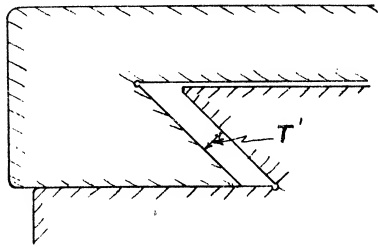

Fig. 17.14(b) Rear View of Members. (t') thickness

Fig. 26.33 Testing alignment of inside ways of bed. RECOMMENDED STANDARDS

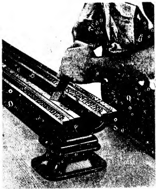

PLATE 29. Close-up of hand scraping the ways on a lathe bed. (Courtesy - South Bend Lathe Works.)

markings cannot be produced except by spreading the compound on the work surface.) The tail stock is moved by hand, back-and-forth a few times, the full length of the bed ways. After removing the tail-stock the inside ways of the bed are scraped in accordance with the markings produced by the spotting action of the template.

This lengthy movement, while counter to the usual spotting practice is justified in the present application. It is not anticipated that the spotting action with this small template will indicate straightness of the ways from end to end. Rather the primary purpose is to disclose the angular value being developed in the inverted V-way and to show how intimately the slides of the tail stock match the mating ways of the bed i.e. area contact. A STRAIGHT EDGE of appropriate length is applied alternately to develop flatness and straightness over an extended area.

OBJECTIVE NO. 1 is attained when the markings on the flat way and both sides of the inverted V-way have uniform coloration and distribution the entire length of the bed when produced by the spotting action of the tailstock base.

The set up to check OBJECTIVE NO. 2 requires mounting the carriage on the bed ways and attaching a DIAL INDICATOR to the carriage. The contact button of the DIAL is adjusted to touch one sloping side of the inverted V-way being tested. Then the carriage is moved the entire length of the bed meanwhile noting any change in the reading of the DIAL. Next the other inclined side of the inverted V-way is tested in the same manner. Finally, the flat way is checked. The tolerance shown in Fig. 26.33 must not be exceeded in any case.

<table border=1 style='margin: auto; word-wrap: break-word;'><tr><td style='text-align: center; word-wrap: break-word;'>Tool Room</td><td style='text-align: center; word-wrap: break-word;'>12&quot; to 18&quot; inc.</td><td style='text-align: center; word-wrap: break-word;'>20&quot; to 36&quot; inc.</td></tr><tr><td style='text-align: center; word-wrap: break-word;'>lathes</td><td style='text-align: center; word-wrap: break-word;'>Engine lathes</td><td style='text-align: center; word-wrap: break-word;'>Engine lathes</td></tr><tr><td style='text-align: center; word-wrap: break-word;'>.0005&quot; in 48&quot;</td><td style='text-align: center; word-wrap: break-word;'>.00075&quot; in 48&quot;</td><td style='text-align: center; word-wrap: break-word;'>.001&quot; in 48&quot;</td></tr><tr><td colspan="3">(Maximum reading along length of bed)</td></tr></table>

Additionally, the PRECISION LEVEL is set crosswise from time to time, on the bed flat way. It is desirable to keep this surface horizontal so that when the machine is placed in operation, wear will be uniform on both ways.

Scraping is continued until all OBJECTIVES are satisfied.

Sec. 26.44

The Rear Carriage Gib Way of the Bed.

The major bearing surfaces of the lathe bed have now been completed and we can turn our attention to the rear carriage gib way of the bed, shown as (5) in Fig. 26.34. This surface is used as a hold-down bearing surface for the carriage and is situated directly under the rear inverted V-way of the bed. On some lathes the rear carriage gib way of the bed is in direct bearing contact with the gib bracket (7) boiled to the rear carriage gib bracket bearing represented by (6) in Fig. 26.39. This clamping strip (gib

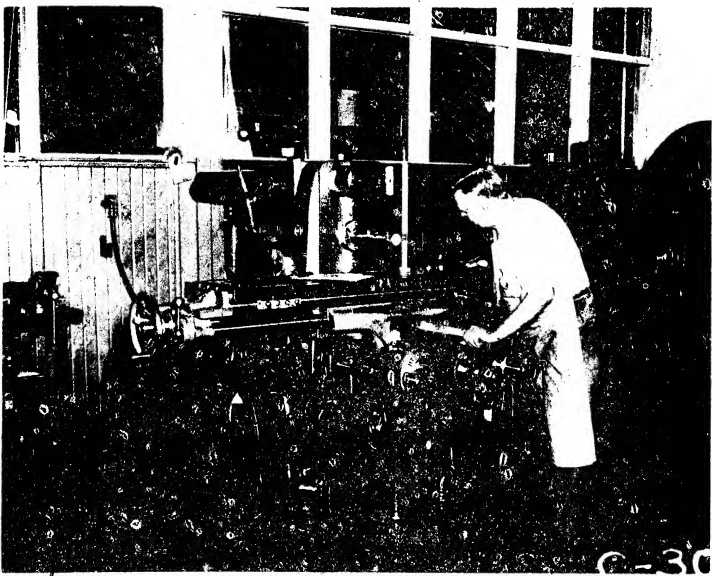

PLATE 52. Checking table top for squareness with guiding way of column utilizing vertical movement of knee of horizontal milling machine. Note the scraped triangle clamped to the table top. (Courtesy - Kearney & Trecker Corp.)

reading is noted.

If the tolerance given in Fig. 27.88 is exceeded, the fault will be located in one or more of three possible sources, namely:

1. The flat way of the knee may be mis-aligned with the guiding way of the column.

2. The flat slide of the saddle may not be parallel with the flat ways of the saddle.

3. The flat slides of table may not be parallel with top of table.

To ascertain the source of error more definitely, a series of tests must be undertaken. In brief, they are as follows in the order in which the errors noted above are listed.

1. After the table and saddle are removed, the alignment of the flat way of knee to the guiding way of column is checked utilizing the procedure

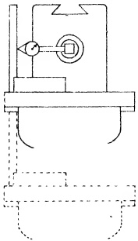

Fig. 27.88 Table top square with vertical movement of knee (in a plane parallel with column). Tolerance max. .001" in 18".

discussed in Sec. 27.35. If a misalignment is indicated, the flat way of the knee must be rescaped. This alters the parallelism of the gib bracket ways of the knee, in the transverse direction. Consequently, these

Sec. 27.101

STATIC ALIGNMENT TEST NO. 8(part1)

#### Sec. 27.100 STATIC ALIGNMENT TEST NO. 7

surfaces must be reoriented by scraping them parallel with the flat way of knee. The guiding way and gib way of this member must also be rescaped so that they are square with the flat way. In addition, the gib bracket bearings of the saddle and all the lower bearing surfaces of the saddle must be realigned, and the gib piece re-fitted to match the new conditions originating in the rescraping of the knee ways. Thus it can be seen that extensive reworking involving several surfaces would be required if a misalignment of the flat ways of knee to guiding way of column were discovered at this time. (See Note)

3. If the preceding test shows that both the flat slides and flat ways of the saddle are correctly aligned, it leaves as a final possibility the slides of the table. The parallelism of the slides of table to the top of table can be verified without removing the member by conducting STATIC ALIGNMENT TEST NO. 7 described in Sec. 27.100.

2. On the other hand, if the flat ways of the knee are within the tolerance, suspicion falls on the flat slides of saddle. Tests specified in Sec. 27.52 will indicate if this doubt is justified.

It can thus be seen that by a process of elimination, the error will be located in one of the foregoing steps.

NOTE: STATIC ALIGNMENT TESTS NO. 6 and NO. 8 are usually performed in succession so that if misalignment is apparent all corrective work on the knee flat way can be performed at the same time.

Rise and Fall of Table in Longitudinal Movement

PROCEDURE:

After an arbor is inserted into the spindle hole, a DIAL INDICATOR is fastened to it and adjusted so that the button is in contact with the top of the table. The average reading is noted as the table is moved back and forth under the button of the instrument.

Should the tolerance given in Fig.27.89 be exceeded it indicates that the flat slides of table are not parallel with respect to the top of table, measured in the longitudinal direction. The error is corrected by scraping the flat slides of table as described in Sec.27.87.

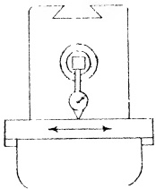

Fig. 27.89 Rise and fall of table in longitudinal movement. Tolerance max. .001" in 24".

Cross Movement of Saddle Parallel with Spindle in Vertical Plane

PROCEDURE:

The first step is to insert the test bar in the spindle and perform a run out test. When the mean position of eccentricity error of the test bar is determined, it is stationed at the vertical diameter. Mounting a DIAL INDICATOR on the top of table, the button is placed in contact with the test bar at the vertical diameter. The cross-movement of the saddle is employed to move the instrument along the bar.

Should the reading on the instrument

Fig. 27.90(a) Cross movement parallel with spindle in vertical plane. Tolerance max. .001" in 12". (Low point at rear)

disclose that the unilateral tolerance specified in Fig. 27.90a has been exceeded, the misalignment is caused by the flat ways of the knee not being square with the column face. This can be proved by removing the table and saddle and conducting tests suggested in Sec. 27.35.

To rectify the vertical misalignment it will be necessary to rescrape the flat way of the knee. This, however, affects the alignment of the gib bracket ways which also must be rescaped to maintain parallelism, vertically, with the flat way of knee. In addition, the bracket bearings of saddle must be rescaped to compensate for the reduced distance between the flat way and the gib bracket ways of knee. Thus it can be seen that when the initial alignment on the individual member was not correctly performed, a whole series of operations must be done over.

Sec. 27.102

STATIC ALIGNMENT TEST NO. 8 (part 2)

Cross Movement of Saddle Parallel with Spindle in Horizontal Plane

##### PROCEDURE:

Next the mean position of eccentricity error of the test bar is turned to the horizontal diameter and the button of the DIAL is placed in contact thereon. The cross-movement of the saddle is utilized to pass the button of the instrument along the test bar.

If there is a misalignment in excess of the tolerance shown in Fig. 27.90b, it is caused by the guiding way of knee not being square with column face. To prove this the table and saddle are removed, and the tests discussed in Sec. 27.35 are applied.

Correction of the error in the horizontal plane is made by rescraping the guiding way of the knee. This in turn necessitates rescraping the gib way of the same member. Since the effect of such modification is cumulative, it will also require alteration of the gib piece.

Sec. 27.103

STATIC ALIGNMENT TEST NO. 9

Parallelism of Over Arm with Spindle in Vertical and Horizontal Planes

Fig. 27.90(b) Cross movement parallel with spindle in horizontal plane. Tolerance max. .001" in 12".

##### PROCEDURE:

After the test bar is inserted into the tapered hole in the spindle, a run out test is conducted to determine if it is aligned with the spindle. This test also locates the mean position of eccentricity error on the bar.

Next a DIAL INDICATOR is suitably attached to the over arm member, which is then adjusted for sliding pressure. With the contact button of the instrument on the vertical diameter of the test bar, the over arm is run in and out. This is repeated on the horizontal diameter. The test bar is turned so that the mean position is utilized in both planes successively.

If the tolerance given in Fig. 27.91 is exceeded in the vertical plane, the flat ways of the over arm support must be rescaped to correct the misalignment. This error should have been noted during the scraping and aligning procedure outlined in Sec. 27.37.

When the misalignment in the horizontal plane exceeds the tolerance, same figure, it will be necessary to rescrape

Fig. 27.91 Parallelism of over arm member with respect to spindle in vertical and horizontal plane. Tolerance for both planes max. .001" in 18".

the guiding way of the over arm support. The procedure covering this surface is specified in Sec. 27.38.

The gibbed surface may also require treatment to achieve parallelism with the guiding way.

Sec. 27.104

STATIC ALIGNMENT TEST NO. 10

Alignment of the Arbor Supports with the Spindle

PROCEDURE:

A test bar is inserted into the bore of the arbor support. This is followed by introducing a stub arbor into the tapered hole of the spindle and attaching a DIAL INDICATOR to it. The swing round method, discussed in Sec. 16.4, is applied. If the tolerance represented in Fig.27.92 is exceeded, then the bearing surfaces of the arbor support must be again scraped to correct the misalignment. This procedure is outlined in Sec. 27.45.

Sec. 27.105

STATIC ALIGNMENT TEST NO. 11

## Table Top Parallel with the Spindle

PROCEDURE:

The test bar is introduced into the spindle hole and tested for run out. If true, the bar is revolved to place the mean position of eccentricity error at the vertical diameter. Next a DIAL INDICATOR attached to a Surface Gage is set at the front of the table top. The button of the instrument is placed in contact with the bar at the vertical diameter. As the device is moved by hand back and forth under the test bar, the maximum deflection is noted. This is repeated with the gage at the back of the table.

If the unilateral tolerance, represented in Fig. 27.93, is exceeded, then the error may be traced to one or more of three conditions, viz:

1. The flat way of the knee is not aligned to the column face. The procedure outlined in Sec. 27.35 should be re-checked.

2. The upper ways of saddle and lower slides of saddle are not parallel as measured in the transverse direction.

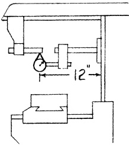

Fig. 27.92 Alignment of arbor support with spindle. Tolerance max. run out .001".

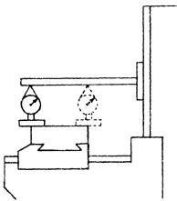

Fig. 27.93 Table top parallel with spindle. Tolerance max. .001" in 12". (Low point at rear)

The procedure described in Sec. 27.52 should be gone over again.

3. The flat slides of table are not parallel with the top of table as measured in the transverse direction. The procedure given in Sec. 27.87 should be repeated.

When the source of the misalignment is located, it is eliminated by scraping the appropriate surfaces.

Sec. 27.106

STATIC ALIGNMENT TEST NO. 12

Center T-slot parallel with the Table Movement (top view)

PROCEDURE:

An arbor is inserted into the spindle hole. After attaching a DIAL INDICATOR to the arbor, the button of the instrument is positioned against the throat of the T-slot. As the table is moved longitudinally any variation in the reading is noted. Then the button is transferred to the other side of T-slot where the procedure

<table border=1 style='margin: auto; word-wrap: break-word;'><tr><td style='text-align: center; word-wrap: break-word;'></td><td style='text-align: center; word-wrap: break-word;'>per foot</td><td style='text-align: center; word-wrap: break-word;'>in total length</td></tr><tr><td style='text-align: center; word-wrap: break-word;'></td><td style='text-align: center; word-wrap: break-word;'></td><td style='text-align: center; word-wrap: break-word;'>(+) .001&quot;</td></tr><tr><td style='text-align: center; word-wrap: break-word;'>Table screw</td><td style='text-align: center; word-wrap: break-word;'>(+) .001&quot;</td><td style='text-align: center; word-wrap: break-word;'>(-) .002&quot;</td></tr><tr><td style='text-align: center; word-wrap: break-word;'></td><td style='text-align: center; word-wrap: break-word;'></td><td style='text-align: center; word-wrap: break-word;'>(+) .001&quot;</td></tr><tr><td style='text-align: center; word-wrap: break-word;'>Cross screw</td><td style='text-align: center; word-wrap: break-word;'>(+) .001&quot;</td><td style='text-align: center; word-wrap: break-word;'>(-) .002&quot;</td></tr><tr><td style='text-align: center; word-wrap: break-word;'></td><td style='text-align: center; word-wrap: break-word;'></td><td style='text-align: center; word-wrap: break-word;'>(+) .001&quot;</td></tr><tr><td style='text-align: center; word-wrap: break-word;'>Vertical screw</td><td style='text-align: center; word-wrap: break-word;'>(+) .001&quot;</td><td style='text-align: center; word-wrap: break-word;'>(-) .002&quot;</td></tr></table>

Fig. 27.97(b) Maximum error in total length. per foot in total length

<table border=1 style='margin: auto; word-wrap: break-word;'><tr><td colspan="3">Fig. 27.97(a) Backlash in lead screws read on dial.</td></tr><tr><td style='text-align: center; word-wrap: break-word;'></td><td style='text-align: center; word-wrap: break-word;'>Tolerance max.</td><td style='text-align: center; word-wrap: break-word;'></td></tr><tr><td style='text-align: center; word-wrap: break-word;'>Table screw</td><td style='text-align: center; word-wrap: break-word;'>.005&quot;</td><td style='text-align: center; word-wrap: break-word;'></td></tr><tr><td style='text-align: center; word-wrap: break-word;'>Cross screw</td><td style='text-align: center; word-wrap: break-word;'>.005&quot;</td><td style='text-align: center; word-wrap: break-word;'></td></tr><tr><td style='text-align: center; word-wrap: break-word;'>Vertical screw</td><td style='text-align: center; word-wrap: break-word;'>.008&quot;</td><td style='text-align: center; word-wrap: break-word;'></td></tr></table>

Sec. 27.109 STATIC ALIGNMENT TEST NO. 15

is repeated. Thus both sides of the T-slot will be tested.

If the tolerance given in Fig. 27.94 is exceeded, it signifies that the guided slide of the table is not parallel with the center T-slot and hence must be rescraped. This action necessitates reworking the gib slide of the table until it too is parallel. The procedures relating to these bearing surfaces are treated in Sec. 27.88 and Sec. 27.89 respectively.

### Sec. 27.107 STATIC ALIGNMENT TEST NO. 13

Center T-slot Square with Spindle (top view) Standard Saddle

PROCEDURE:

Center the table. Then press two ground PARALLELS into the center T-slot at points equi-distant from the midpoint of the table. After inserting the arbor into the spindle hole, a DIAL INDICATOR with attached arm is fastened to it. The swing round method is utilized to obtain a DIAL reading against each ground PARALLEL in turn.

If the tolerance shown in Fig. 27.95 is exceeded, the guided slide of the saddle needs to be rescaped to correct this misalignment. As a consequence, the

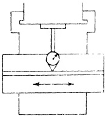

Fig. 27.94 Center T-slot parallel with table movement. Tolerance max. .001" in 18".

Fig. 27.95 Center T-slot square with spindle. Tolerance max. .001" in 18".

tapered gib of the saddle may require alteration to match the new taper which will now exist between the gib way of knee and the lower gibbed surface of saddle. The procedure relating to this surface is discussed in Sec. 27.53.

Sec. 27.108
STATIC ALIGNMENT TEST NO. 14

T-slots square with Top of Table

#### PROCEDURE:

Fig. 27.96 is self-explanatory and requires no description. Tolerance max. .001" per inch.

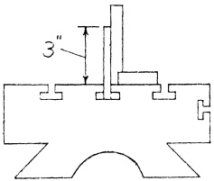

Fig. 27.96 T-slots square with top of table. Tolerance max. .001" in 3". The drawing is self-explanatory.

Sec. 27.110
STATIC ALIGNMENT TEST NO. 16

(For Universal Saddle)

Axis of Pivot Offset with respect to Axis of Spindle.

##### PROCEDURE:

A test bar is inserted in the spindle, given a run out test and turned to place the mean position of eccentricity error in the horizontal plane. The table is moved longitudinally until one end is flushed with the end of the saddle. The universal saddle-table assembly is now adjusted transversely on the knee to locate the axis of the pivot approximately under the free end of the test bar. A DIAL INDICATOR is rigidly positioned on the table top with the plunger adjusted to touch the free end of the test bar at the horizontal diameter.

The table is swiveled  $ 18^{\circ} $ thus placing the plunger of the instrument against the test bar on the opposite side. The difference between the two readings indicates the amount of offset of the axis of the pivot with the axis of the spindle. The tolerance allowed is shown in Fig. 27.98. If the tolerance is exceeded, the reason may be found outlined in Sec. 27.8C.

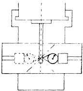

Fig. 27.98 Axis of pivot offset with respect to axis of spindle. Tolerance max. .002".

Sec. 27.111

STATIC ALIGNMENT TEST NO. 17

(For Universal Saddle)

Center T-slot offset with respect to Axis of Pivot.

PROCEDURE:

A test bar is inserted in the spindle, a run out test conducted, and the bar turned to place the mean position of eccentricity error in the horizontal plane.

The saddle-table assembly is swiveled so that the center T-slot is parallel with the axis of the spindle.

A DIAL INDICATOR is attached to a jig. The jig is placed in the center T-slot against one side of the T-slot throat. When this is accomplished, the plunger of the instrument is adjusted to touch the test bar at the horizontal diameter, and a reading is taken.

The DIAL INDICATOR and jig are transferred intact to the other side of the throat of the center T-slot. The reading is noted. The difference in readings denotes the amount of offset of the center T-slot with respect to the axis of the pivot.

The tolerance allowed is indicated in Fig. 27.99. If the tolerance is exceeded, the reason may be found by reference to Sec. 27.81.

Fig. 27.99 Center T-slot offset with respect to axis of pivot. Toleranc- max. .002".

Chapter 28

THE VERTICAL MILLING MACHINE

The vertical milling machine falls into two principal classifications, viz:

1. The Sliding Head Vertical Miller, wherein the head is adjustable in a vertical direction while the axis of the spindle remains in a vertical plane.

2. The Swivel Head Vertical Miller, wherein the head is held at a fixed height but is free to swivel, thereby allowing the axis of the spindle to be in any plane between vertical and horizontal.

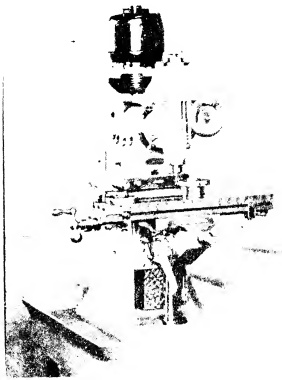

PLATE 53. Vertical milling machine with swivel head. (Courtesy - Elgin Tool Works.)

In the following pages a vertical milling machine utilizing the Sliding Head will be discussed. Fig. 28.1 shows such a machine completely assembled. This familiar machine tool has many points of similarity to a horizontal miller but it also has other distinctive features which are peculiar to it alone, and therefore of special interest to the scraping operator. For this reason, a detailed description of the problem and the procedure involved in reconditioning the Vertical Miller is justified.

Fig. 28.1 Assembled Vertical Milling Machine showing principal parts.

(1) column (2) sliding head (3) knee (4) saddle (5) table (6) pedestal and boss

### Sec. 28.1 The Sliding Head Vertical Milling Machine

The sliding head vertical miller described and illustrated in this chapter, combines the structural design found on popular models of several manufacturers. One notable difference between the elementary form shown in Fig. 28.1 and the one illustrating the horizontal miller in Fig. 27.1 will be readily apparent. This machine utilizes dovetails on most of the principal members, whereas the example demonstrating the horizontal miller consists mainly of square edges. As a result, scaping methods vary as between machines, although the alignment tests, and the requirements thereof, are somewhat similar. The reason for varying the type of bearing surface is to provide information in treating a variety of bearing surfaces.

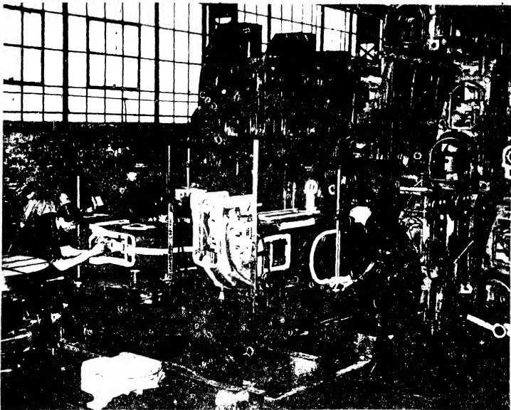

PLATE 54. Laying out a column casting of a vertical milling machine preliminary to machining. Note the care shown in laying out each surface to be machined. (Courtesy - Kearney & Trecker Corp.)

### Sec. 28.2 Components

The various members of the Vertical Milling Machine of interest to the scraping operator are enumerated and described as follows:

1. The Column: The massive casting supporting the combined weight of the other machine members, in addition to the work piece, is known as the column, or frame. This member has two groups of bearing surfaces, viz: the lower group, or column ways, that guide the knee; the upper group, or head support ways, that guide the sliding head.

2. The Sliding Head: This member is guided vertically by the ways of the head support located at the top of the column. The sliding head encloses the spindle.

3. The Knee: The component, guided by the ways of the column and vertically adjustable, is called the knee. It supports the saddle and table assembly.

4. The Plain Saddle: The lower bearing surfaces of this member are guided in cross-movement by the ways of the knee. The upper bearing surfaces guide the table in longitudinal movement.

5. The Table: The top surface of this member is provided with T-slots. This feature permits the work piece and also various attachments, such as the vise, the dividing head etc., to be secured by means of bolts.

The several members of the Sliding Head Vertical Milling Machine will be discussed in the order enumerated above. This is also the logical sequence of scraping operations.

Sec. 28.3

The Column

For purposes of convenience and clarity the bearing surfaces of the column are

Sec. 28.72

STATIC ALIGNMENT TEST NO. 10

preferably, a hardened steel test plate is interposed. (Sec. 8.7 Hardened Steel Plates.)

Utilizing the swing round method, we test front and rear for a unilateral tolerance, as shown in Fig. 28.53. Should the tolerance be exceeded, several possibilities suggest themselves, viz:

1. The knee flat ways are not square with the column face. To eliminate this possibility, the test outlined in Sec. 28.55 can be adopted.

2. The flat slides and flat ways of the saddle are not parallel (measured transversely). A pertinent test to apply is described in Sec. 27.52. (Horizontal Milling Machine)

3. The flat slides and the top of the table are not parallel. The appropriate test of this condition is discussed in Sec. 27.87. (Horizontal Milling Machine)

Fig. 28.53 Table top square with spindle. (Front and rear) Tolerance max. .001" in 12", preferably low at back.

One or more of these alternatives may be the cause of the misalignment. To narrow it down proceed as follows:

One member at a time is removed while the remaining members are tested. Thus if the table is found to be accurate, it is set to one side. Then the ways of the saddle are tested to learn whether they are square with the column face. If the error is still present, the flat ways of the knee are tested. By this process of elimination, the source of the misalignment of a particular machine can be located. Test NO. 10 should be made concurrently.

Table Top Square with the Spindle (Right and Left)

PROCEDURE:

The same equipment used in Test No. 9 is employed for this test. The swing-round method is utilized to determine if the tolerance indicated in Fig. 28.54 is exceeded. With the table centrally located, longitudinally and transversely, under the spindle, measurements at right and left are taken. A zero-zero reading is desirable although a small tolerance is permissible.

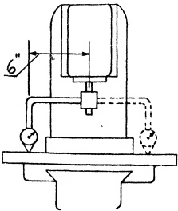

Fig. 28.54 Table top square with spindle. (Right and left) Tolerance max. .001" in 18".

Should a misalignment be disclosed, several possibilities suggest themselves. For example:

1. The flat ways of knee are not square with the column guiding way. An appropriate test for this is outlined in Sec. 28.56.

2. The flat slide and flat ways of the saddle (measured longitudinally) are not parallel. This possibility can be checked as described in Sec. 27.52. (Horizontal Milling Machine)

3. The flat slides and top of the table are not parallel. This likelihood results from negligent execution of the procedure discussed in Sec. 27.87. (Horizontal Milling Machine)

When the tolerance is exceeded, it is possible to find the faulty member, or members, by a process of elimination. This is accomplished by removing one

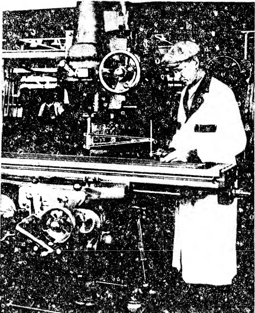

PLATE 56. Testing alignment of table top square with spindle (right and left) of Vertical milling machine. Note the hardened steel testing block under button of DIAL INDICATOR. (Courtesy - Kearney & Trecker Corp.)

component at a time, starting with the table, and testing from the top-most surface of the next member below, and so on. Tests NO. 9 and NO. 10 should be performed together.

Incidentally, the 3rd point mentioned above may be checked by an alternative method without removing the table. It is discussed in the next test, NO. 11.

Sec. 28.73

STATIC ALIGNMENT TEST NO. 11

Rise and Fall of Table in Longitudinal Movement

PROCEDURE:

A stub arbor is inserted into the spindle and a DIAL INDICATOR is attached. The DIAL button is adjusted to rest on the table top. The table is moved longitudinally the maximum distance beneath the DIAL button while the reading is observed. Fig. 28.55 shows the allowed tolerance. If exceeded, it signifies that the table flat slides were not scraped parallel with the table top (measured in the longitudinal direction.) The error in this instance can lie only in the table member.

Before removing the table to correct this misalignment, TEST NO. 12 should be conducted. This is advisable so that in case an error is disclosed, attributed to the flat slides not being parallel as measured in the transverse direction to the top of table, they may be rescraped to a resultant of both tests.

Fig. 28.55 Rise and fall of table in longitudinal movement. Tolerance max. .0005" in 24".

Sec. 28.74

STATIC ALIGNMENT TEST NO. 12

Rise and Fall of Table in Cross Movement

PROCEDURE:

A stub arbor is inserted into the spindle and a DIAL INDICATOR is attached. The button of the DIAL, as in the previous test, touches the table top, as represented in Fig. 28.56. By moving the table transversely towards the column, the DIAL is actuated.

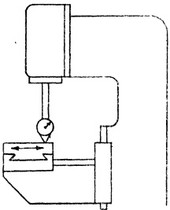

Fig. 28.56 Rise and fall of table in cross movement. Tolerance max. .001" in 12".

Incidentally, only sufficient pressure should be applied to the DIAL mechanism to obtain a reading. This precaution has for its purpose the protection of the delicate works of the instrument from shock damage as the button drops into the T-slots passing beneath. If instead of positioning the DIAL button directly upon the top of table, a steel PARALLEL is interposed, this danger is eliminated.

In case the tolerance is exceeded, it denotes that the table flat slides were not scraped parallel with the table top as required by the OBJECTIVES given in Sec. 27.87 (measuring transversely.) To correct the misalignment it will be necessary to remove the table and rescrape the flat slides.

This procedure presupposes that any lack of parallelism is exclusively the fault of the table. But we should not lose sight of the fact that the fault now discernible, may have had its inception when the saddle was dealt with. For example, the scraping tolerance of the saddle may have been exceeded. In such cases, the table would not be responsible for the present difficulty, or only partiy so. To discover the origin of the misalignment it will be necessary to remove the table then repeat the test on the flat ways of the saddle. Usually no one member is wholly responsible but rather each contributes something to the deficiency.

Sec. 28.75

STATIC ALIGNMENT TEST NO. 13

Center T-Slot Parallel with Table Movement

PROCEDURE:

A stub arbor is inserted into the spindle and a DIAL INDICATOR is attached. The button of the DIAL is positioned against one side of the throat of the T-slot. After moving the table the maximum distance, longitudinally, any change in the reading is noted. This operation is then repeated with the DIAL button in contact with the other side of the throat. Should the tolerance shown in Fig. 28.57 be exceeded in either case it signifies that the guided slide of the table was not scraped parallel with the center T-slot as required by the OBJECTIVES in Sec. 27.88 (Table of Horizontal Milling Machine).

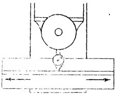

Fig. 28.57 Center T-slot parallel with table movement. Tolerance max. .001" in 18".

Since the center T-spot was selected as the check point for various surfaces of the table member, as discussed in Sec. 27.85, it will be necessary to remove the table and rescrape the angular guided slide to correct this misalignment. As a consequence, the angular gibbed slide of the table must also be rescraped parallel with the guided slide. Furthermore, the gib piece may need to be refitted, provided templates were not used to obtain a definite angular value for the gibbed slide.

Sec. 28.76

STATIC ALIGNMENT TEST NO. 14

Center T-Slot Square with Cross Movement

PROCEDURE:

A SQUARE is laid horizontally on the table top with the blade approximately parallel to the center T-slot as shown in Fig. 28.58. It is clamped lightly. A Surface Gage is positioned in the center T-slot. Next the DIAL button is set against the blade of the SQUARE. As the Gage is slid along the T-slot, the SQUARE is true until the DIAL reading is exactly zero-zero from end to end of the blade. The blade of the SQUARE will now be parallel with the center T-slot, and it should be immovably clamped in this position.

Fig. 28.58 View showing method of arranging set up for testing center T-slot in cross movement.

It is necessary at this point to insert a stub arbor into the spindle and attach the DIAL to it. Fig. 28.59a shows how the button of the DIAL is positioned against the beam of the SQUARE. The table is moved transversely and the reading of the instrument is noted.

If the tolerance shown in Fig. 28.59b is exceeded, the misalignment can be corrected by rescraping the guided slide of the saddle. The usual alterations to the gibbed surface and gib piece will, of course, be required.

Fig. 28.59(a) Testing T-slot square with cross movement.

Fig. 28.59(b) Center T-slot square with cross movement. Tolerance max. .001" in 12".

Sec. 28.77

ALIGNMENT TEST NO. 15

T-slots Square with Top of Table

PROCEDURE:

The set up for this test is described in detail in Sec. 27.84 (Table Top of the Horizontal Milling Machine).

Since the procedure is exactly the same and since Fig. 28.60 is practically self-explanatory, we shall not discuss this test further.

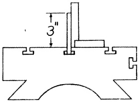

Fig. 28.60 T-slots square with top of table. Tolerance max. .001" in 3".

Sec. 28.78

STATIC ALIGNMENT TEST NO. 16

Back Lash in Lead Screws

<table border=1 style='margin: auto; word-wrap: break-word;'><tr><td style='text-align: center; word-wrap: break-word;'>Fig. 28.61(b)</td><td style='text-align: center; word-wrap: break-word;'>Maximum Error in Total Length</td></tr><tr><td style='text-align: center; word-wrap: break-word;'></td><td style='text-align: center; word-wrap: break-word;'>max. in 12&quot; in total length</td></tr><tr><td style='text-align: center; word-wrap: break-word;'></td><td style='text-align: center; word-wrap: break-word;'>(+) .002&quot;</td></tr><tr><td rowspan="3">Table screw</td><td style='text-align: center; word-wrap: break-word;'>(+) .001&quot;</td></tr><tr><td style='text-align: center; word-wrap: break-word;'>(-) .001&quot;</td></tr><tr><td style='text-align: center; word-wrap: break-word;'>(+) .002&quot;</td></tr><tr><td rowspan="2">Cross Feed screw</td><td style='text-align: center; word-wrap: break-word;'>(+) .001&quot;</td></tr><tr><td style='text-align: center; word-wrap: break-word;'>(-) .001&quot;</td></tr><tr><td rowspan="2">Vertical Feed screw (+) .001&quot;</td><td style='text-align: center; word-wrap: break-word;'>(+) .001&quot;</td></tr><tr><td style='text-align: center; word-wrap: break-word;'>(-) .001&quot;</td></tr><tr><td style='text-align: center; word-wrap: break-word;'>Sliding Head screw (+) .001&quot;</td><td style='text-align: center; word-wrap: break-word;'>(-) .001&quot;</td></tr></table>

##### PROCEDURE:

1. The permissible back lash. This is noted on the DIAL as the hand wheel or the feed screw is oscillated the maximum possible but without moving the member being tested. Tolerance is represented in Fig. 28.61a.

<table border=1 style='margin: auto; word-wrap: break-word;'><tr><td style='text-align: center; word-wrap: break-word;'>Fig. 29.61(a)</td><td style='text-align: center; word-wrap: break-word;'>Back Lash in Lead Screws. Read on Dials.</td><td style='text-align: center; word-wrap: break-word;'>max. tolerance</td></tr><tr><td style='text-align: center; word-wrap: break-word;'>Table screw</td><td style='text-align: center; word-wrap: break-word;'>.005&quot;</td><td style='text-align: center; word-wrap: break-word;'></td></tr><tr><td style='text-align: center; word-wrap: break-word;'>Cross Feed screw</td><td style='text-align: center; word-wrap: break-word;'>.005&quot;</td><td style='text-align: center; word-wrap: break-word;'></td></tr><tr><td style='text-align: center; word-wrap: break-word;'>Vertical Feed screw</td><td style='text-align: center; word-wrap: break-word;'>.008&quot;</td><td style='text-align: center; word-wrap: break-word;'></td></tr><tr><td style='text-align: center; word-wrap: break-word;'>Sliding Head screw</td><td style='text-align: center; word-wrap: break-word;'>.005&quot;</td><td style='text-align: center; word-wrap: break-word;'></td></tr></table>

2. The maximum error in total length. Considerable testing equipment of a special nature would be necessary for this set up. Furthermore, since the information obtained would be of interest to only a few, space devoted to this subject would hardly be justified. Tolerance is shown in Fig. 28.61b.

This completes the STATIC ALIGNMENT TESTS on the Vertical Milling Machine. Essentially, we have ascertained the degree of accuracy with which the machine is assembled. All measurements have been made with the machine idle and in the unloaded condition.

Performance tests involving working tolerances are not within the scope of this book. Many factors influence the grade of working accuracy, besides the condition of the bearing surfaces themselves. If the scraping operator has not exceeded the tolerances allotted to him, he may be reasonably confident that he has discharged his share of responsibility in the work of reconditioning a vertical milling machine. However, many operators will wish to test the completed machine under operating conditions. For specific standards, the Manufacturer's Test Record Card is recommended.

Chapter 29

# PRECISION GRINDING MACHINES THE CYLINDRICAL GRINDER

Precision grinding machines are a class of machine tool designed to give a very smooth finish to ordinary machined surfaces. When lathes, millers, shapers etc. machine metal surfaces, they produce apparently smooth finishes which suffice for many purposes. However smooth the finishes may appear to the eye, an examination under a microscope plainly reveals numerous ridges and furrows. To further smooth out the small irregularities which are formed, PRECISION GRINDING MACHINES are used. Producing work pieces of accurate dimension, rapidly, and at economical cost is another and equally important reason for the popularity of precision grinders.

The principal parts of a precision grinder comprise a massive bed, a wheel head, a revolving wheel spindle on which the grinding wheel is mounted, and a work table.

Grinding machines are made for a wide variety of purposes, and to perform these jobs, each classification of grinder is provided with diverse movements. For example, the wheel and its spindle revolve independently of the work, and the wheel head may be controlled by a traverse feed, and in-feed, or both, depending on the type of machine.

Tables are of two classes; reciprocating tables, which draw the metal piece back and forth across the face or flank of the revolving wheel; and revolving tables, which carry the metal piece under the abrasive wheel. To facilitate grinding, tables may be equipped with a transverse feed, and in-feed, a vertical feed, or all three.

In all types of grinders, provision is made for selective changes of cutting speed (peripheral speed of grinding wheel), work speed (peripheral speed of work), rate of table traverse (sweep of grinding wheel across the face of the work), and rate of wheel in-feed (depth of metal removed).

To actuate the various parts, mechanical, hydraulic, or electrical means are employed.

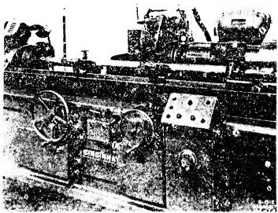

PLATE 57. Front view of cylindrical grinder grinding a piece of work between centers. Note form of guiding way of swivel plate. (Courtesy - Cincinnati Grinders, Incorporated.)

The bearing surfaces on which the various components slide vary widely in shape according to the special operations the machine must perform or the preference of individual designers. Horizontal reciprocating tables may ride on double V's, inverted V's, opposed V's, or one V-way and one flat way.

Positioning of foot stock, workhead, journal rests etc. is accomplished by means of dovetails, an inclined V-and flat way, or a flat way and T-slot. The particular angles these ways possess varies considerably.

Another method of providing movement is by mounting the work table on balls or rollers running in hardened and ground ways. This system eliminates all

traces of irregular table motion and is required for machines such as thread grinders or roll grinders. The wheel head slides and dressing tool slides of thread grinders may also be mounted on rollers.

On some machines the rollers bear directly on cast iron surfaces. On other machines, the rollers bear against hardened, steel inserts, fastened to the iron surfaces. These surfaces must always be scraped flat and true upon reconditioning if the slightest warp is present. New and straight inserts are then attached.

Circular ways designed to carry the load of horizontal rotary tables are also made. These ways are usually flat since the alignment of the table is controlled by a central spindle.

The kinds of jobs performed on precision grinders is not a proper subject for this book. However, it may be interesting to point out that grinding, to maintain tolerances of plus or minus .0005" is common in everyday production. For very special work, designers have produced modern grinding machines that can achieve an accuracy so exact, that to express it, a new term "micro-inch" (one millionth part of an inch) has been coined. This measurement is now familiar in some industries where special devices for testing have been developed.

To produce this extreme accuracy, grinders are being made heavier to absorb vibration, and more strongly ribbed to give increased rigidity to the machine. Every part that turns or slides receives the most exacting attention so that when these machines are completed at the factory they are the ultimate in accuracy and perfection. The ways and slides of these machines are as flat and as parallel as it is possible to make them. This perfection is of special interest to the scraping operator because it is his problem, in reconditioning the machine, to restore the bearing surfaces to their original accuracy.

Besides the worn flat bearings there are other factors involved in the reconditioning process which if not corrected could aggravate existing defects or even induce new errors. These include worn or defective gearing, feed screws, spindle, spindle bearings etc. The specific treatment required to restore these components to their original accuracy is beyond the scope of this book and therefore will not be treated except in the briefest manner when special circumstances warrant it.

The varieties of grinding machines are so numerous that it would require several volumes to describe separately, the reconditioning processes on each type. They are separable, however, into two general classifications according as to whether they grind cylindrical surfaces, or grind flat surfaces.

To explain the scraping and aligning procedure on the general group of cylindrical grinders, we have selected a Cylindrical Grinder with Universal Workhead as typical of the class. This choice was made because it is a well known, widely used machine. For this demonstration, as in previous ones, an elementary form will again be used.

In order to have the scraping procedure in harmony with conditions as they are found in most shops, we will use the few-est possible number of spotting or testing gages. Reliance will be placed in the few standard tools found in average shops, and when practicable, in the components of the machine employed as Templates.

Sec. 29.1

The Cylindrical Grinder: Components

The cylindrical grinder, illustrated in Fig. 29.1, consists of five members which are the prime concern of the scraping operator. In addition to the fundamental components enumerated below, the grinding machine is often equipped with special attachments which greatly increase the versatility of the machine. The methods of reconditioning these minor parts will not be discussed. When such work is called for, it is thought that the principles and practices recommended for treatment of the various standard parts will, if thoroughly understood, be entirely adequate to cope with this auxiliary equipment.

1. The Bed (1). The main casting of the cylindrical grinder is called the bed. It is a large, heavy casting made of a good grade of cast iron or semi-steel. It is substantially ribbed to provide a rigid foundation for the other

Fig. 29.1 The Cylindrical Grinding Machine.

(1) bed (2) work table (3) swivel plate (4) wheel head (5) work head (6) footstock

components. The bed is constructed with two sets of ways. The longitudinal ways guide the work-table; and the transverse ways support the wheelhead.

2. The Work-Table. (Comprising two parts, the table proper and the swivel plate)

a) The Table (2) is a long, relatively thin, rectangular casting ribbed for strength. It has two groups of bearing surfaces. Underneath are the slides which bear on the bed ways, permitting longitudinal movement. The top surface of the table supports the swivel plate.

b) The Swivel Plate (3) rests on the table. It is a long, thin, rectangular casting machined all over. This member has two groups of bearing surfaces. The top bearing surface is distinguished by a T-slot extending longitudinally through the center of the casting. Both the workhead and footstock clamp to the T-slot. A guiding way is incorporated in the top surface and aligns these members. The lower surface has a stud that inserts in a corresponding hole in the table top. The swivel plate pivots around this central stud.

3. The Wheelhead (4). This member is guided by the transverse ways of the bed. It mounts the grinding wheel and an electric motor to drive the wheel.

4. The Workhead or Headstock (5). This member supports one end of a work piece. It m�ts an electric motor which drives the work piece by a combination of V-belts, silent chains etc. An integral part of the workhead is a rotating spindle to which a chuck may be attached. The spindle is built to perform two functions:

(1) To operate as a live center head