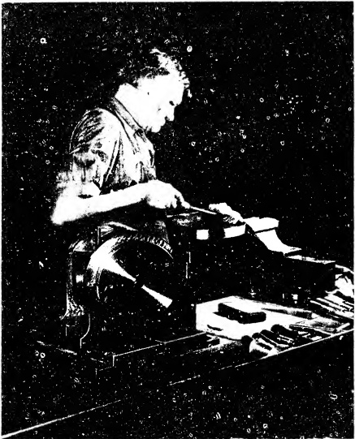

The following table shows how a surface can be improved step by step. It will be noted that as the chip size is reduced the number of bearing spots increase.

Size of Cut Approximate number of bearing spots per square (length x width) inch.

 $$ \begin{array}{r l r l r l}&{1/4\mathrm{''}\mathrm{~x~}1/4\mathrm{''}}&&{8\mathrm{~-~}12}\\ &{3/16\mathrm{''}\mathrm{~x~}3/16\mathrm{''}}&&{18\mathrm{~-~}22}\\ &{1/8\mathrm{''}\mathrm{~x~}1/8\mathrm{''}}&&{30\mathrm{~-~}35}\end{array} $$ 

When scraping an average surface an actual physical count of the bearing spots per square inch is seldom if ever made, except on SURFACE PLATES and STRAIGHT EDGES. The conclusions as to the bearing quality of a scraped surface are based on its overall appearance, as judged after a final application of a very thin film of marking compound with a spotting tool. The anticipated number of bearing spots per square inch may reasonably be expected by following the recommendations given in the table above.

It is easy to camouflage scraping marks, in which case the expected bearing quality will not be realized. However, we are speaking here of sincere efforts to produce a workmanlike job. In this connection, a method of judging bearing quality with reasonable accuracy is described in Sec. 22.19 Judging Bearing Quality.

Sec. 6.17

Touching Up

This is merely a continuation of Finish Scraping carried over into the field of fitting slides to ways. It is a desirable practice as it gives the newly produced alignment an added permanence. In other words, if the bearing quality is to be enhanced and the alignment stabilized, it is necessary for the various surfaces to be touched up before the machine tool is put in operation.

The reason for this statement can be better understood by considering the condition of a surface immediately following the final cycle of finish scraping. For instance, the bearing spots that have been formed by the scraping process are now all in one

PLATE 5. (#A74) Scraping work in process on a Cincinnati dividing head. The assembler is scraping one of the half-round clamps. Note in foreground the Arkansas honing stone in case. (Courtesy - Cincinnati Milling Machine Co.)

