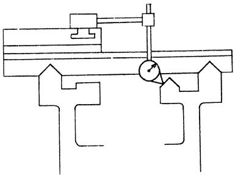

Fig. 26.33 Testing alignment of inside ways of bed. RECOMMENDED STANDARDS

PLATE 29. Close-up of hand scraping the ways on a lathe bed. (Courtesy - South Bend Lathe Works.)

markings cannot be produced except by spreading the compound on the work surface.) The tail stock is moved by hand, back-and-forth a few times, the full length of the bed ways. After removing the tail-stock the inside ways of the bed are scraped in accordance with the markings produced by the spotting action of the template.

This lengthy movement, while counter to the usual spotting practice is justified in the present application. It is not anticipated that the spotting action with this small template will indicate straightness of the ways from end to end. Rather the primary purpose is to disclose the angular value being developed in the inverted V-way and to show how intimately the slides of the tail stock match the mating ways of the bed i.e. area contact. A STRAIGHT EDGE of appropriate length is applied alternately to develop flatness and straightness over an extended area.

OBJECTIVE NO. 1 is attained when the markings on the flat way and both sides of the inverted V-way have uniform coloration and distribution the entire length of the bed when produced by the spotting action of the tailstock base.

The set up to check OBJECTIVE NO. 2 requires mounting the carriage on the bed ways and attaching a DIAL INDICATOR to the carriage. The contact button of the DIAL is adjusted to touch one sloping side of the inverted V-way being tested. Then the carriage is moved the entire length of the bed meanwhile noting any change in the reading of the DIAL. Next the other inclined side of the inverted V-way is tested in the same manner. Finally, the flat way is checked. The tolerance shown in Fig. 26.33 must not be exceeded in any case.

<table border=1 style='margin: auto; word-wrap: break-word;'><tr><td style='text-align: center; word-wrap: break-word;'>Tool Room</td><td style='text-align: center; word-wrap: break-word;'>12&quot; to 18&quot; inc.</td><td style='text-align: center; word-wrap: break-word;'>20&quot; to 36&quot; inc.</td></tr><tr><td style='text-align: center; word-wrap: break-word;'>lathes</td><td style='text-align: center; word-wrap: break-word;'>Engine lathes</td><td style='text-align: center; word-wrap: break-word;'>Engine lathes</td></tr><tr><td style='text-align: center; word-wrap: break-word;'>.0005&quot; in 48&quot;</td><td style='text-align: center; word-wrap: break-word;'>.00075&quot; in 48&quot;</td><td style='text-align: center; word-wrap: break-word;'>.001&quot; in 48&quot;</td></tr><tr><td colspan="3">(Maximum reading along length of bed)</td></tr></table>

Additionally, the PRECISION LEVEL is set crosswise from time to time, on the bed flat way. It is desirable to keep this surface horizontal so that when the machine is placed in operation, wear will be uniform on both ways.

Scraping is continued until all OBJECTIVES are satisfied.

Sec. 26.44

The Rear Carriage Gib Way of the Bed.

The major bearing surfaces of the lathe bed have now been completed and we can turn our attention to the rear carriage gib way of the bed, shown as (5) in Fig. 26.34. This surface is used as a hold-down bearing surface for the carriage and is situated directly under the rear inverted V-way of the bed. On some lathes the rear carriage gib way of the bed is in direct bearing contact with the gib bracket (7) boiled to the rear carriage gib bracket bearing represented by (6) in Fig. 26.39. This clamping strip (gib