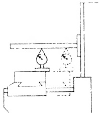

Sec. 27.101

STATIC ALIGNMENT TEST NO. 8(part1)

##### Sec. 27.100 STATIC ALIGNMENT TEST NO. 7

surfaces must be reoriented by scraping them parallel with the flat way of knee. The guiding way and gib way of this member must also be rescaped so that they are square with the flat way. In addition, the gib bracket bearings of the saddle and all the lower bearing surfaces of the saddle must be realigned, and the gib piece re-fitted to match the new conditions originating in the rescraping of the knee ways. Thus it can be seen that extensive reworking involving several surfaces would be required if a misalignment of the flat ways of knee to guiding way of column were discovered at this time. (See Note)

3. If the preceding test shows that both the flat slides and flat ways of the saddle are correctly aligned, it leaves as a final possibility the slides of the table. The parallelism of the slides of table to the top of table can be verified without removing the member by conducting STATIC ALIGNMENT TEST NO. 7 described in Sec. 27.100.

2. On the other hand, if the flat ways of the knee are within the tolerance, suspicion falls on the flat slides of saddle. Tests specified in Sec. 27.52 will indicate if this doubt is justified.

It can thus be seen that by a process of elimination, the error will be located in one of the foregoing steps.

NOTE: STATIC ALIGNMENT TESTS NO. 6 and NO. 8 are usually performed in succession so that if misalignment is apparent all corrective work on the knee flat way can be performed at the same time.

Rise and Fall of Table in Longitudinal Movement

PROCEDURE:

After an arbor is inserted into the spindle hole, a DIAL INDICATOR is fastened to it and adjusted so that the button is in contact with the top of the table. The average reading is noted as the table is moved back and forth under the button of the instrument.

Should the tolerance given in Fig.27.89 be exceeded it indicates that the flat slides of table are not parallel with respect to the top of table, measured in the longitudinal direction. The error is corrected by scraping the flat slides of table as described in Sec.27.87.

Fig. 27.89 Rise and fall of table in longitudinal movement. Tolerance max. .001" in 24".

Cross Movement of Saddle Parallel with Spindle in Vertical Plane

PROCEDURE:

The first step is to insert the test bar in the spindle and perform a run out test. When the mean position of eccentricity error of the test bar is determined, it is stationed at the vertical diameter. Mounting a DIAL INDICATOR on the top of table, the button is placed in contact with the test bar at the vertical diameter. The cross-movement of the saddle is employed to move the instrument along the bar.

Should the reading on the instrument

Fig. 27.90(a) Cross movement parallel with spindle in vertical plane. Tolerance max. .001" in 12". (Low point at rear)