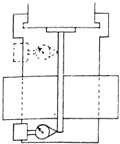
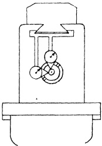

disclose that the unilateral tolerance specified in Fig. 27.90a has been exceeded, the misalignment is caused by the flat ways of the knee not being square with the column face. This can be proved by removing the table and saddle and conducting tests suggested in Sec. 27.35.

To rectify the vertical misalignment it will be necessary to rescrape the flat way of the knee. This, however, affects the alignment of the gib bracket ways which also must be rescaped to maintain parallelism, vertically, with the flat way of knee. In addition, the bracket bearings of saddle must be rescaped to compensate for the reduced distance between the flat way and the gib bracket ways of knee. Thus it can be seen that when the initial alignment on the individual member was not correctly performed, a whole series of operations must be done over.

Sec. 27.102

STATIC ALIGNMENT TEST NO. 8 (part 2)

Cross Movement of Saddle Parallel with Spindle in Horizontal Plane

## PROCEDURE:

Next the mean position of eccentricity error of the test bar is turned to the horizontal diameter and the button of the DIAL is placed in contact thereon. The cross-movement of the saddle is utilized to pass the button of the instrument along the test bar.

If there is a misalignment in excess of the tolerance shown in Fig. 27.90b, it is caused by the guiding way of knee not being square with column face. To prove this the table and saddle are removed, and the tests discussed in Sec. 27.35 are applied.

Correction of the error in the horizontal plane is made by rescraping the guiding way of the knee. This in turn necessitates rescraping the gib way of the same member. Since the effect of such modification is cumulative, it will also require alteration of the gib piece.

Sec. 27.103

STATIC ALIGNMENT TEST NO. 9

Parallelism of Over Arm with Spindle in Vertical and Horizontal Planes

Fig. 27.90(b) Cross movement parallel with spindle in horizontal plane. Tolerance max. .001" in 12".

## PROCEDURE:

After the test bar is inserted into the tapered hole in the spindle, a run out test is conducted to determine if it is aligned with the spindle. This test also locates the mean position of eccentricity error on the bar.

Next a DIAL INDICATOR is suitably attached to the over arm member, which is then adjusted for sliding pressure. With the contact button of the instrument on the vertical diameter of the test bar, the over arm is run in and out. This is repeated on the horizontal diameter. The test bar is turned so that the mean position is utilized in both planes successively.

If the tolerance given in Fig. 27.91 is exceeded in the vertical plane, the flat ways of the over arm support must be rescaped to correct the misalignment. This error should have been noted during the scraping and aligning procedure outlined in Sec. 27.37.

When the misalignment in the horizontal plane exceeds the tolerance, same figure, it will be necessary to rescrape

Fig. 27.91 Parallelism of over arm member with respect to spindle in vertical and horizontal plane. Tolerance for both planes max. .001" in 18".

