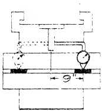

<table border=1 style='margin: auto; word-wrap: break-word;'><tr><td style='text-align: center; word-wrap: break-word;'></td><td style='text-align: center; word-wrap: break-word;'>per foot</td><td style='text-align: center; word-wrap: break-word;'>in total length</td></tr><tr><td style='text-align: center; word-wrap: break-word;'></td><td style='text-align: center; word-wrap: break-word;'></td><td style='text-align: center; word-wrap: break-word;'>(+) .001&quot;</td></tr><tr><td style='text-align: center; word-wrap: break-word;'>Table screw</td><td style='text-align: center; word-wrap: break-word;'>(+) .001&quot;</td><td style='text-align: center; word-wrap: break-word;'>(-) .002&quot;</td></tr><tr><td style='text-align: center; word-wrap: break-word;'></td><td style='text-align: center; word-wrap: break-word;'></td><td style='text-align: center; word-wrap: break-word;'>(+) .001&quot;</td></tr><tr><td style='text-align: center; word-wrap: break-word;'>Cross screw</td><td style='text-align: center; word-wrap: break-word;'>(+) .001&quot;</td><td style='text-align: center; word-wrap: break-word;'>(-) .002&quot;</td></tr><tr><td style='text-align: center; word-wrap: break-word;'></td><td style='text-align: center; word-wrap: break-word;'></td><td style='text-align: center; word-wrap: break-word;'>(+) .001&quot;</td></tr><tr><td style='text-align: center; word-wrap: break-word;'>Vertical screw</td><td style='text-align: center; word-wrap: break-word;'>(+) .001&quot;</td><td style='text-align: center; word-wrap: break-word;'>(-) .002&quot;</td></tr></table>

Fig. 27.97(b) Maximum error in total length. per foot in total length

<table border=1 style='margin: auto; word-wrap: break-word;'><tr><td colspan="3">Fig. 27.97(a) Backlash in lead screws read on dial.</td></tr><tr><td style='text-align: center; word-wrap: break-word;'></td><td style='text-align: center; word-wrap: break-word;'>Tolerance max.</td><td style='text-align: center; word-wrap: break-word;'></td></tr><tr><td style='text-align: center; word-wrap: break-word;'>Table screw</td><td style='text-align: center; word-wrap: break-word;'>.005&quot;</td><td style='text-align: center; word-wrap: break-word;'></td></tr><tr><td style='text-align: center; word-wrap: break-word;'>Cross screw</td><td style='text-align: center; word-wrap: break-word;'>.005&quot;</td><td style='text-align: center; word-wrap: break-word;'></td></tr><tr><td style='text-align: center; word-wrap: break-word;'>Vertical screw</td><td style='text-align: center; word-wrap: break-word;'>.008&quot;</td><td style='text-align: center; word-wrap: break-word;'></td></tr></table>

Sec. 27.109 STATIC ALIGNMENT TEST NO. 15

is repeated. Thus both sides of the T-slot will be tested.

If the tolerance given in Fig. 27.94 is exceeded, it signifies that the guided slide of the table is not parallel with the center T-slot and hence must be rescraped. This action necessitates reworking the gib slide of the table until it too is parallel. The procedures relating to these bearing surfaces are treated in Sec. 27.88 and Sec. 27.89 respectively.

##### Sec. 27.107 STATIC ALIGNMENT TEST NO. 13

Center T-slot Square with Spindle (top view) Standard Saddle

PROCEDURE:

Center the table. Then press two ground PARALLELS into the center T-slot at points equi-distant from the midpoint of the table. After inserting the arbor into the spindle hole, a DIAL INDICATOR with attached arm is fastened to it. The swing round method is utilized to obtain a DIAL reading against each ground PARALLEL in turn.

If the tolerance shown in Fig. 27.95 is exceeded, the guided slide of the saddle needs to be rescaped to correct this misalignment. As a consequence, the

Fig. 27.94 Center T-slot parallel with table movement. Tolerance max. .001" in 18".

Fig. 27.95 Center T-slot square with spindle. Tolerance max. .001" in 18".

tapered gib of the saddle may require alteration to match the new taper which will now exist between the gib way of knee and the lower gibbed surface of saddle. The procedure relating to this surface is discussed in Sec. 27.53.

Sec. 27.108
STATIC ALIGNMENT TEST NO. 14

T-slots square with Top of Table

## PROCEDURE:

Fig. 27.96 is self-explanatory and requires no description. Tolerance max. .001" per inch.

Fig. 27.96 T-slots square with top of table. Tolerance max. .001" in 3". The drawing is self-explanatory.

