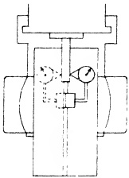

Sec. 27.110
STATIC ALIGNMENT TEST NO. 16

(For Universal Saddle)

Axis of Pivot Offset with respect to Axis of Spindle.

## PROCEDURE:

A test bar is inserted in the spindle, given a run out test and turned to place the mean position of eccentricity error in the horizontal plane. The table is moved longitudinally until one end is flushed with the end of the saddle. The universal saddle-table assembly is now adjusted transversely on the knee to locate the axis of the pivot approximately under the free end of the test bar. A DIAL INDICATOR is rigidly positioned on the table top with the plunger adjusted to touch the free end of the test bar at the horizontal diameter.

The table is swiveled  $ 18^{\circ} $ thus placing the plunger of the instrument against the test bar on the opposite side. The difference between the two readings indicates the amount of offset of the axis of the pivot with the axis of the spindle. The tolerance allowed is shown in Fig. 27.98. If the tolerance is exceeded, the reason may be found outlined in Sec. 27.8C.

Fig. 27.98 Axis of pivot offset with respect to axis of spindle. Tolerance max. .002".

Sec. 27.111

STATIC ALIGNMENT TEST NO. 17

(For Universal Saddle)

Center T-slot offset with respect to Axis of Pivot.

PROCEDURE:

A test bar is inserted in the spindle, a run out test conducted, and the bar turned to place the mean position of eccentricity error in the horizontal plane.

The saddle-table assembly is swiveled so that the center T-slot is parallel with the axis of the spindle.

A DIAL INDICATOR is attached to a jig. The jig is placed in the center T-slot against one side of the T-slot throat. When this is accomplished, the plunger of the instrument is adjusted to touch the test bar at the horizontal diameter, and a reading is taken.

The DIAL INDICATOR and jig are transferred intact to the other side of the throat of the center T-slot. The reading is noted. The difference in readings denotes the amount of offset of the center T-slot with respect to the axis of the pivot.

The tolerance allowed is indicated in Fig. 27.99. If the tolerance is exceeded, the reason may be found by reference to Sec. 27.81.

Fig. 27.99 Center T-slot offset with respect to axis of pivot. Toleranc- max. .002".

