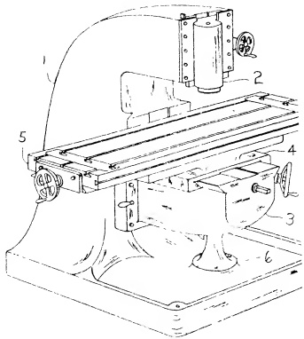

Chapter 28

THE VERTICAL MILLING MACHINE

The vertical milling machine falls into two principal classifications, viz:

1. The Sliding Head Vertical Miller, wherein the head is adjustable in a vertical direction while the axis of the spindle remains in a vertical plane.

2. The Swivel Head Vertical Miller, wherein the head is held at a fixed height but is free to swivel, thereby allowing the axis of the spindle to be in any plane between vertical and horizontal.

PLATE 53. Vertical milling machine with swivel head. (Courtesy - Elgin Tool Works.)

In the following pages a vertical milling machine utilizing the Sliding Head will be discussed. Fig. 28.1 shows such a machine completely assembled. This familiar machine tool has many points of similarity to a horizontal miller but it also has other distinctive features which are peculiar to it alone, and therefore of special interest to the scraping operator. For this reason, a detailed description of the problem and the procedure involved in reconditioning the Vertical Miller is justified.

Fig. 28.1 Assembled Vertical Milling Machine showing principal parts.

(1) column (2) sliding head (3) knee (4) saddle (5) table (6) pedestal and boss

#### Sec. 28.1 The Sliding Head Vertical Milling Machine

The sliding head vertical miller described and illustrated in this chapter, combines the structural design found on popular models of several manufacturers. One notable difference between the elementary form shown in Fig. 28.1 and the one illustrating the horizontal miller in Fig. 27.1 will be readily apparent. This machine utilizes dovetails on most of the principal members, whereas the example demonstrating the horizontal miller consists mainly of square edges. As a result, scaping methods vary as between machines, although the alignment tests, and the requirements thereof, are somewhat similar. The reason for varying the type of bearing surface is to provide information in treating a variety of bearing surfaces.