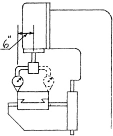

Sec. 28.72

STATIC ALIGNMENT TEST NO. 10

preferably, a hardened steel test plate is interposed. (Sec. 8.7 Hardened Steel Plates.)

Utilizing the swing round method, we test front and rear for a unilateral tolerance, as shown in Fig. 28.53. Should the tolerance be exceeded, several possibilities suggest themselves, viz:

1. The knee flat ways are not square with the column face. To eliminate this possibility, the test outlined in Sec. 28.55 can be adopted.

2. The flat slides and flat ways of the saddle are not parallel (measured transversely). A pertinent test to apply is described in Sec. 27.52. (Horizontal Milling Machine)

3. The flat slides and the top of the table are not parallel. The appropriate test of this condition is discussed in Sec. 27.87. (Horizontal Milling Machine)

Fig. 28.53 Table top square with spindle. (Front and rear) Tolerance max. .001" in 12", preferably low at back.

One or more of these alternatives may be the cause of the misalignment. To narrow it down proceed as follows:

One member at a time is removed while the remaining members are tested. Thus if the table is found to be accurate, it is set to one side. Then the ways of the saddle are tested to learn whether they are square with the column face. If the error is still present, the flat ways of the knee are tested. By this process of elimination, the source of the misalignment of a particular machine can be located. Test NO. 10 should be made concurrently.

Table Top Square with the Spindle (Right and Left)

PROCEDURE:

The same equipment used in Test No. 9 is employed for this test. The swing-round method is utilized to determine if the tolerance indicated in Fig. 28.54 is exceeded. With the table centrally located, longitudinally and transversely, under the spindle, measurements at right and left are taken. A zero-zero reading is desirable although a small tolerance is permissible.

Fig. 28.54 Table top square with spindle. (Right and left) Tolerance max. .001" in 18".

Should a misalignment be disclosed, several possibilities suggest themselves. For example:

1. The flat ways of knee are not square with the column guiding way. An appropriate test for this is outlined in Sec. 28.56.

2. The flat slide and flat ways of the saddle (measured longitudinally) are not parallel. This possibility can be checked as described in Sec. 27.52. (Horizontal Milling Machine)

3. The flat slides and top of the table are not parallel. This likelihood results from negligent execution of the procedure discussed in Sec. 27.87. (Horizontal Milling Machine)

When the tolerance is exceeded, it is possible to find the faulty member, or members, by a process of elimination. This is accomplished by removing one