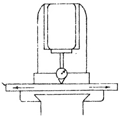

PLATE 56. Testing alignment of table top square with spindle (right and left) of Vertical milling machine. Note the hardened steel testing block under button of DIAL INDICATOR. (Courtesy - Kearney & Trecker Corp.)

component at a time, starting with the table, and testing from the top-most surface of the next member below, and so on. Tests NO. 9 and NO. 10 should be performed together.

Incidentally, the 3rd point mentioned above may be checked by an alternative method without removing the table. It is discussed in the next test, NO. 11.

Sec. 28.73

STATIC ALIGNMENT TEST NO. 11

Rise and Fall of Table in Longitudinal Movement

PROCEDURE:

A stub arbor is inserted into the spindle and a DIAL INDICATOR is attached. The DIAL button is adjusted to rest on the table top. The table is moved longitudinally the maximum distance beneath the DIAL button while the reading is observed. Fig. 28.55 shows the allowed tolerance. If exceeded, it signifies that the table flat slides were not scraped parallel with the table top (measured in the longitudinal direction.) The error in this instance can lie only in the table member.

Before removing the table to correct this misalignment, TEST NO. 12 should be conducted. This is advisable so that in case an error is disclosed, attributed to the flat slides not being parallel as measured in the transverse direction to the top of table, they may be rescraped to a resultant of both tests.

Fig. 28.55 Rise and fall of table in longitudinal movement. Tolerance max. .0005" in 24".

