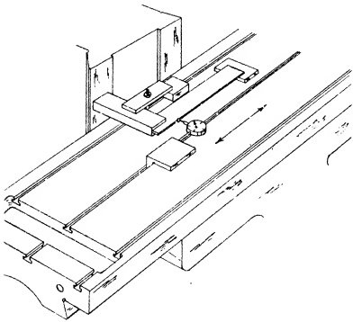
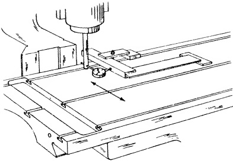
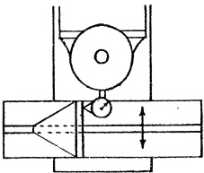

Sec. 28.76

STATIC ALIGNMENT TEST NO. 14

Center T-Slot Square with Cross Movement

PROCEDURE:

A SQUARE is laid horizontally on the table top with the blade approximately parallel to the center T-slot as shown in Fig. 28.58. It is clamped lightly. A Surface Gage is positioned in the center T-slot. Next the DIAL button is set against the blade of the SQUARE. As the Gage is slid along the T-slot, the SQUARE is true until the DIAL reading is exactly zero-zero from end to end of the blade. The blade of the SQUARE will now be parallel with the center T-slot, and it should be immovably clamped in this position.

Fig. 28.58 View showing method of arranging set up for testing center T-slot in cross movement.

It is necessary at this point to insert a stub arbor into the spindle and attach the DIAL to it. Fig. 28.59a shows how the button of the DIAL is positioned against the beam of the SQUARE. The table is moved transversely and the reading of the instrument is noted.

If the tolerance shown in Fig. 28.59b is exceeded, the misalignment can be corrected by rescraping the guided slide of the saddle. The usual alterations to the gibbed surface and gib piece will, of course, be required.

Fig. 28.59(a) Testing T-slot square with cross movement.

Fig. 28.59(b) Center T-slot square with cross movement. Tolerance max. .001" in 12".

Sec. 28.77

ALIGNMENT TEST NO. 15

T-slots Square with Top of Table

PROCEDURE:

The set up for this test is described in detail in Sec. 27.84 (Table Top of the Horizontal Milling Machine).

Since the procedure is exactly the same and since Fig. 28.60 is practically self-explanatory, we shall not discuss this test further.

Fig. 28.60 T-slots square with top of table. Tolerance max. .001" in 3".

