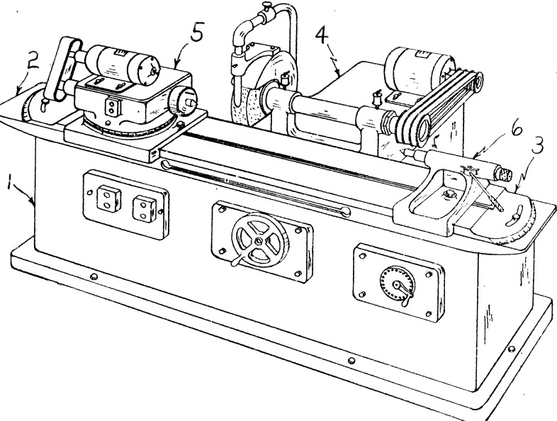

Fig. 29.1 The Cylindrical Grinding Machine.

(1) bed (2) work table (3) swivel plate (4) wheel head (5) work head (6) footstock

components. The bed is constructed with two sets of ways. The longitudinal ways guide the work-table; and the transverse ways support the wheelhead.

2. The Work-Table. (Comprising two parts, the table proper and the swivel plate)

a) The Table (2) is a long, relatively thin, rectangular casting ribbed for strength. It has two groups of bearing surfaces. Underneath are the slides which bear on the bed ways, permitting longitudinal movement. The top surface of the table supports the swivel plate.

b) The Swivel Plate (3) rests on the table. It is a long, thin, rectangular casting machined all over. This member has two groups of bearing surfaces. The top bearing surface is distinguished by a T-slot extending longitudinally through the center of the casting. Both the workhead and footstock clamp to the T-slot. A guiding way is incorporated in the top surface and aligns these members. The lower surface has a stud that inserts in a corresponding hole in the table top. The swivel plate pivots around this central stud.

3. The Wheelhead (4). This member is guided by the transverse ways of the bed. It mounts the grinding wheel and an electric motor to drive the wheel.

4. The Workhead or Headstock (5). This member supports one end of a work piece. It m�ts an electric motor which drives the work piece by a combination of V-belts, silent chains etc. An integral part of the workhead is a rotating spindle to which a chuck may be attached. The spindle is built to perform two functions:

(1) To operate as a live center head