<!-- page 1 -->

# ACKNOWLEDGMENTS

The author wishes to express thanks to a number of industrial concerns who greatly aided the preparation of this Ms. by providing photographs and technical information.

Credit lines accompanying the illustrations indicate those who so generously helped. In addition, the author's appreciation is extended to the following:

American Tool Works
Cincinnati, Ohio

Anderson Bros. Mfg. Co.
Rockford, Ill.

Atlas Press Company
Kalamazoo, Mich.

Brown & Sharpe Co.
Providence, R. I.

Cincinnati Grinders, Incorporated
Cincinnati, Ohio

Cincinnati Milling Machine Co.
Cincinnati, Ohio

DoAll Company
Des Plaines, Ill.

Dykem Company
St. Louis, Mo.

Elgin Tool Works
Chicago, Ill.

Franklin Institute of the State of Pennsylvania
Philadelphia, Pennsylvania

Gallmeyer and Livingston Co.
Grand Rapids, Mich.

Herman Stone Company
Dayton, Ohio

Kearney & Trecker Corp.
Milwaukee, Wis.

Landis Tool Company
Waynesboro, Pa.

Library of Congress
General Reference and Bibliography
Division

National Lead Company - Research Laboratories
Brooklyn, N. Y.

National Machine Tool Builders' Association
Cleveland, Ohio

Norton Company
Worcester, Mass.

Sheffield Bronze Paint Corp.
Cleveland, Ohio

South Bend Lathe Works
South Bend, Ind.

Starrett, L. S., Company
Athol, Mass.

Taft-Peirce Manufacturing Co.
Woonsocket, R. I.

<!-- page 2 -->

# Chapter 1

# THE ART OF SCRAPING

In this chapter we will introduce hand scraping to the beginner in the machinist's trade. This subject scarcely needs any introduction to experienced machinists who know well its laborious processes. The tedium and the difficulty of the work have been, and still are, standing invitations to "Yankee ingenuity" to make improvements in the metal working trades. Undoubtedly, great strides have been made, but despite the rapid advance of technology in the mechanical fields it still is not possible to produce with either a reciprocating or rotary tool, except under special conditions, the true, flat, close-grained surfaces that are essential for a first class bearing. This is the reason that practice in hand scraping is desirable in the training of apprentices. It is also the reason why proficiency in this art ranks high among the machinist's acquired skills.

Sec. 1.1

Definition of Scraping

Scraping is that hand process which produces a flat, close grained surface on work which is finish machined. It is the final delicate removal, flake by flake, with a hand tool, of the minute irregularities which, though scarcely perceptible to the eye, stand up like saw teeth on the metal surface of the work. The removal of this roughness, without destructive effect to the remainder of the surface, comprises the art of scraping.

Another way to express the same thought is to define scraping as an operation to eliminate the high spots on machined surfaces thereby producing bearing spots that are in one plane.

Sec. 1.2

Plane Surface in Theory and Practice

To prevent future misunderstanding it is important to realize exactly what the

term plane surface, or flat surface signifies. A plane surface is defined as a surface such that if any two points on the surface be joined by a straight line, every point on the line will be in contact with the surface. In other words, it is a surface without rotundity, curvature, depression or other variation or inequality. Practically speaking, it cannot be achieved by any known process, be it hand scraping, surface grinding, super-finishing, lapping, etc.

A flat surface, therefore, is merely relative. It is usually considered to be a surface which will bear on a theoretical plane at a sufficient number of places to satisfy accepted standards.

In each trade, or art, the term "flat" will be accorded a different meaning. The carpenter accepts the smoothly finished wooden level, or steel square, accurate within thousandths of an inch, as sufficiently flat to be used as a reference to gage his work.

This basis is not acceptable to the machinist because it is too crude. His measurements range into tenths of thousandths of an inch. The SURFACE PLATE, STRAIGHT EDGE, and PRECISION LEVEL are his representative standards of flatness.

This is not the ultimate by any means. Even higher requirements are demanded by the gage maker, whose gages must be accurate to millionths of an inch. Fortunately, such precision is not required in the hand scraping process.

It thus can be seen that in referring to flatness, we are not alluding to some theoretical ideal but rather have in mind the practical possibilities of producing a flat metal surface by hand scraping.

Sec. 1.3

Hand Scraping Sliding Bearings

The principal use of the hand scraping process is to improve the bearing quality

1

<!-- page 3 -->

accuracy tests. Thus so long as the scraping improves the work surface slightly, even though temporarily, a negligent operator "gets by" for a time.

Eventually, however, his lack of integrity will be discovered. This type of man is particularly unsuited for a scraping specialist.

OUT OUR WAY

BY J. R. WILLIAMS

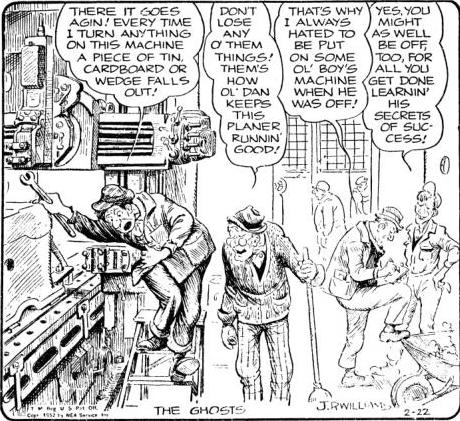

7

<!-- page 4 -->

the tool from scoring the work piece if accidentally canted.

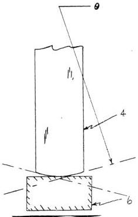

Fig. 5.2a Front view of scraper blade showing radial curvature caused by involuntary lateral rocking of tool during honing stroke.

(4) Flat of blade (6) Honing stone

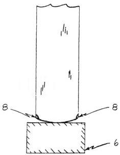

Fig. 5.2b Front view of scraper blade.

(6) Honing stone (8) Rounded, chamfered corners

3. The cutting edge is represented at work in Fig. 5.3.

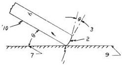

Fig. 5.3 Side view of scraper blade applied to a work surface and held at scraping angle.

(1) Cutting edge (2) Breast (3) Angle of honed bevel \(0^{\circ}\) to \(30^{\circ}\) (7) Scraping angle \(10^{\circ}\) to \(30^{\circ}\)
(9) Work surface being scraped (10) Side of blade

## Sec. 5.7

## Sharpening the Blade

Sharpening the scraper blade is done in two steps. First, is grinding. Second, is honing. They will be discussed in that order.

We will assume that the steel blade is properly hardened and tempered. Commercial blades may be purchased in this condition. Since the basic principles of hardening and tempering steel are adequately treated in many technical books, no further mention will be made of that subject. It is enough to point out that the blade must be hard enough to keep its cutting edge over long periods of time, yet be tough enough so that the edge does not chip and break down easily.

Putting a cutting edge on a scraping blade is started at the bench grinder and must be done carefully. It cannot be emphasized too strongly that in rough grinding, the temper must not be drawn from the blade. Better still, the cutting edge should never be heated so that it becomes uncomfortably warm to the touch. If the rough grinding is properly done the first time, it need be repeated only at infrequent intervals as the blade wears down. Therefore, the few extra minutes spent in doing a conscientious job is time well spent.

## Sec. 5.8

## Grinding the Blade

The first operation is quite elementary

21

<!-- page 5 -->

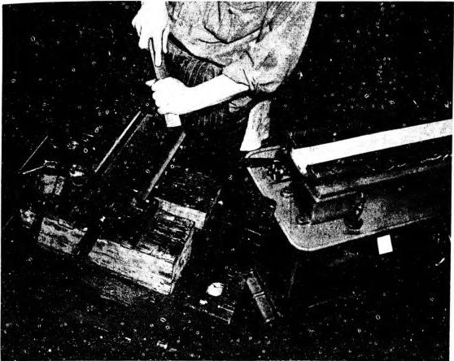

PLATE 4. Hand scraping the base of a turret to fit the bed of a South Bend lathe. (Courtesy - South Bend Lathe Works.)

# Sec. 6.2

# The Body Power Stroke

The second method of hand scraping is known as the body power stroke. It takes advantage of the weight of the operator's body to effect the removal of metal. This method permits unhampered, two handed, directional control in guiding the cutting edge to the proper spot, as well as to the precise depth.

Using the body power stroke, the operator places both hands on the scraper tool in the following positions:

The right hand firmly grasps the tool shank at about the center with the fingers curled under the shank and the thumb extending downward. The palm of the left hand is pressed against the shank but closer to the cutting edge and then shifted up or down as conditions warrant. When the work surroundings are safe the fingers

may be curled naturally. Otherwise, they should be stiffly extended. The left hand regulates the applied pressure which helps control the depth of penetration.

The butt end of the scraping tool is held against the body, usually the upper thigh or at the waist. The exact location is determined by the height of the work. With the body power stroke, the angle of the scraping tool in relation to the work is approximately 10° to 30°.

By swaying the body forward, the cutting edge is forced into the metal in an elliptical path. The movement is downward, forward, upward, and out. The carry-through of the stroke ends with the cutting edge of the tool above the work surface.

The blade is drawn back and again placed on the surface ready for the next thrust. This may be either to the left or right of the previous starting position

29

<!-- page 6 -->

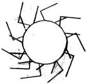

Fig. 6.1 Showing correct way to shave metal at lip of circular hole. To avoid rounding lip of hole do not let blade overhang too far.

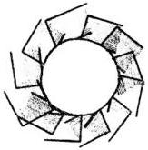

Fig. 6.2 Sketch of incorrect method of scraping around the circumference increase the likelihood of rounding off edges.

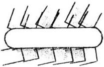

Fig. 6.3 (above) Correct method of scraping to edge of a slot. Strokes approach at a tangent.

(below) Incorrect method because all strokes parallel the edge. A rounded, or turned, edge may result.

with only a minimum of attention given to applying spotting tools, or making tests, it is called off-hand scraping. This method of scraping is particularly adapted to the initial roughing cuts. It is also efficiently

employed at other times when the excess of metal to remove is considerable and when it is thought safe to scrape over the work surface a few times without alternate applications of marking compound. How often or how deeply to scrape, without follow-up checks with a spotting tool, will be, naturally, a matter of individual judgment.

There are certain hazards attendant to the adoption of the practice. A novice would be well advised to defer employing it until experience has been gained.

# Sec. 6.13

Using Tool Marks as Guides for Off-Hand Scraping

It is seldom that a scraping operator will be confronted with the job of scraping a surface flat without the assistance of at least some kind of a spotting tool. Rare though such occasions may be, this adaptation of off-hand scraping still merits some attention.

A fairly satisfactory solution is possible, in spite of this handicap, when the work surface has been finished machined by a machine tool of known accuracy. Then in lieu of using a spotting tool to indicate the contour, the operator can use the tooth marks of the cutting tool as a guide. Each tooth of the cutter of, say, a vertical milling machine, generates tooth marks which vary in depth and appearance and therefore are distinguishable from the marks produced by other teeth of the same cutter tool. In other words, the scratch of each tooth can be traced unerringly across the work surface. Thus by utilizing as a guide the distinctive tooth mark of a certain individual tooth as it tracks from end to end of the work piece, a scraped surface can be produced whose flatness will correspond to the accuracy of the machine.

The technique is to scrape away the metal in such a way that the pattern of tooth marks formed by the milling cutter remains at an even depth below the plane of the scraped surface. On the first cycle, the entire surface is scraped over lightly to smooth the roughness. This serves to remove the faintest scratches. There now remains traces of several tooth marks which are deeper than any of those removed. Selecting the faintest mark as a guide the surface is again scraped all over to eliminate it wherever it appears. Then

34

<!-- page 7 -->

The following table shows how a surface can be improved step by step. It will be noted that as the chip size is reduced the number of bearing spots increase.

Size of Cut Approximate number of bearing spots per square (length x width) inch.

|  1/4" x 1/4" | 8 - 12  |
| --- | --- |
|  3/16" x 3/16" | 18 - 22  |
|  1/8" x 1/8" | 30 - 35  |

When scraping an average surface an actual physical count of the bearing spots per square inch is seldom if ever made, except on SURFACE PLATES and STRAIGHT EDGES. The conclusions as to the bearing quality of a scraped surface are based on its overall appearance, as judged after a final application of a very thin film of marking compound with a spotting tool. The anticipated number of bearing spots per square inch may reasonably be expected by following the recommendations given in the table above.

It is easy to camouflage scraping

marks, in which case the expected bearing quality will not be realized. However, we are speaking here of sincere efforts to produce a workmanlike job. In this connection, a method of judging bearing quality with reasonable accuracy is described in Sec. 22.19 Judging Bearing Quality.

Sec. 6.17
Touching Up

This is merely a continuation of Finish Scraping carried over into the field of fitting slides to ways. It is a desirable practice as it gives the newly produced alignment an added permanence. In other words, if the bearing quality is to be enhanced and the alignment stabilized, it is necessary for the various surfaces to be touched up before the machine tool is put in operation.

The reason for this statement can be better understood by considering the condition of a surface immediately following the final cycle of finish scraping. For instance, the bearing spots that have been formed by the scraping process are now all in one

PLATE 5. (#A74) Scraping work in process on a Cincinnati dividing head. The assembler is scraping one of the half-round clamps. Note in foreground the Arkansas honing stone in case. (Courtesy - Cincinnati Milling Machine Co.)

36

<!-- page 8 -->

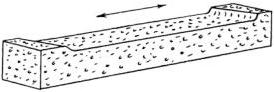

Fig. 7.2 Showing a bench oilstone heavily worn but still capable of imparting a keen edge to the scraper blade.

Second, a properly dimensioned stone helps materially in the formation of the very slight, radially curved edge so necessary in a correctly sharpened blade. This is explained in Sec. 5.11 discussing the honing stroke.

In practice, it will be found that a stone as wide as the blade will usually retain its flatness the full extent of the honing stroke. Experienced operators find that it wears down so uniformly that truing is seldom necessary.

The principal objection to using a stone wider than the scraping blade is that its surface wears down unevenly. Unless the stone is "trued" frequently, the cutting edge of a tool honed on it can assume any haphazard shape, though usually it degenerates into a pronounced radial curvature, or spade shape. Two effects of a pronounced curved edge on the tool are slow speed in scraping and inefficiency. Speed is slow because only a fraction of the edge is in contact with the work surface. Efficiency is impaired because the spade shaped blade naturally cuts deeper, thereby requiring extreme and tiring vigilance on the part of the operator to avoid gouging the work surface.

There has been considerable discussion of the width of the stone because it

so vitally affects the cutting edge of the tool sharpened on it. The length of the cutting stone, on the other hand, does not influence the shape of the scraper blade honed on it. This dimension is not important, and the length is determined mainly by availability or convenience, although 6' is considered the practical minimum.

## Stoning Burrs

Another use of the bench oilstone in scraping practice is for stoning burrs. Before the initial application of the spotting tool, the machined work surface must be smoothed to remove, or blunt sharp projections and thereby prevent damage to the face of the tool. Similarly, after each scraping cycle, and before re-laying the spotting tool, the operation must be repeated.

The bench stone, either natural or synthetic, employed for reducing burrs on a scraped surface should be a fine grit type. Although such a stone scratches the work surface somewhat, it is usually satisfactory for average requirements, even in the final stages when the finish is quite velvety.

The choice of most scrapping operators, who use bench oil stones for smoothing burrs, is one with a knife blade shape. This form allows the stone to reach all the way into the hard-to-reach dovetails.

On the soft, malleable metals, such as copper, bronze, aluminum, and lead, a bench stone will glaze if rubbed on a burred surface. It is preferable, therefore, to employ other methods of dealing with troublesome burrs. For alternatives, refer to Sec. 4.1 on the Burr File and to Sec. 3.6 on the hardened steel block.

40

<!-- page 9 -->

Sec. 13.2

The Try Square

The TRY SQUARE, known variously as the hardened solid steel square, MASTER SQUARE, etc., is shown in Fig. 13.1. It is found in most machine shops where it is used regularly for many purposes. For example, it is utilized in laying out and setting up work; for checking machined surfaces; and more relevant to the scraper, for alignment testing.

For some applications the TRY SQUARE is not as suitable as either the SCRAPED TRIANGLE or the BOX SQUARE. However, one of the aims of this book is to demonstrate how equipment usually found in the average shop can be efficiently employed. Therefore, from time to time, this tool will be incorporated in a number of practical set ups. For such work the TRY SQUARE should be adequate in size and in perfect condition.

The blade of the TRY SQUARE is relatively thin and hence semi-flexible. Since it is subject to bending, considerable care must be exercised when using it while testing alignments.

The tool is applied by the scraper in a number of different ways, including the following:

1. Sighting
2. Tapping with the fingers
3. Testing with feeler gages
4. Testing with a DIAL INDICATOR

Each of these applications will be discussed in the order enumerated above.

Sec. 13.3

Sighting a TRY SQUARE

Sighting a TRY SQUARE is a method of checking the flatness of a surface or its squareness with respect to another surface. The operation consists of laying the beam of the SQUARE on a surface and butting the blade against another surface situated at 90° to the first. The operator sights between the blade and the adjacent surface towards the source of a bright light, such as a window. Since this is a very common practice in machinist work and familiar to all mechanics, it need not be further described.

Within limits it is a qualified test, therefore the following criticism is not meant to under-rate its practicality in its proper field.

Despite its wide acceptance in the machine trade, the scraper does not find sighting with a SQUARE either an efficient or accurate test when he tries to check a scraping alignment. In the first place, the kind of finish has a considerable influence on the reliability of visual testing. A ground surface, for example, being smoother is checked somewhat more accurately by this method than one that is in process of being scrape-finished.

Another objection is that the kind of work pieces usually scraped by hand are generally too large or too heavy to lift or otherwise shift around with facility. Then too, the window frequently is not in line with the work surface being tested.

To overcome this obstacle artificial illumination is sometimes resorted to. However, an ordinary electric lamp drop cord assembly is usually unsatisfactory because the light must be visible at one time along the entire area being sighted. From a stationary position the illumination provided by the lamp is insufficient to range uniformly over the full length of the bearing being checked. While it would be possible to move it along, as the operator scans the space between blade and work, this is ineffectual due to the inability of the retina to compare present with past images.

Over short lengths, the average eye is quite efficient at determining parallelism, or divergence therefrom. However, as the distance increases to a point where the eye cannot take in the complete picture at one glance, its dependability declines. Moreover, it is not capable of estimating the amount of such deviation, which information is so necessary for most alignments. The scraping operator is frequently confronted with situations wherein he must know the degree of error and not merely be aware of the direction such divergence takes.

The reason that the deficiencies of this method have been stressed is that sighting a TRY SQUARE is an accepted test and standard procedure in machine shop practice and for that reason might erroneously be assumed to be equally appropriate for checking scraping alignments. From the

95

<!-- page 10 -->

raising and lowering the DIAL INDICATOR. Elevating the machine part holding the instrument is the simplest way to actuate it. The maximum deflection is noted at both ends of the bar and the difference in readings represents the misalignment existing between the surface guiding the DIAL INDICATOR and the axis of test bar. See Fig. 27.90b.

Sec. 15.11

Test Between Centers

Test bars whether cylindrical or taper shank, are supported at the ends between dead centers while being ground to size. When finished the axis of the bar is, or should be in-line with the axis of revolution.

Since use and abuse have a cumulative effect, the accuracy of the test bar should be verified from time to time. It is obvious that a bent test bar has no value, whatsoever, to a scraper.

One practical method whereby the accuracy of a test bar can be determined would be to duplicate the set up by which it was first produced. This is done by mounting the test bar in question between centers, usually on a lathe. By this test we seek to prove that the axis of the bar is in-line with its axis of rotation. And if such is found to be the case, the test bar has retained its original accuracy. The testing procedure is as follows:

1. The center holes of the test bar are thoroughly cleaned and if thought necessary are tested for burrs with a \(60^{\circ}\) center using marking compound as the indicating medium.
2. The centers of the lathe, grinder or other testing machine are inspected and replaced if found defective due to wear or abuse. The centers used must be perfect cones of a \(60^{\circ}\) angle.
3. The test bar is placed between centers which are adjusted to provide a slight tension to the bar. This eliminates all looseness or end play and provides the most favorable conditions for accurate testing.
4. A DIAL INDICATOR is mounted adjacent to the test bar and adjusted so that the plunger makes contact with the surface of the bar at, say, one end.
5. The bar is revolved by hand between

dead centers and the pointer of the DIAL is watched for any movement.

6. A reading is taken successively at each end of the bar and at intermediate positions.
7. If each reading taken is constant throughout \(360^{\circ}\) of revolution, the test bar is perfect. That is, its axis coincides with the axis of revolution of the bar.
8. If out of true is indicated by a fluctuation of the pointer at one or more of the positions tested, the operator must decide whether it constitutes too large a percent of the tolerance allowed for the application for which the test bar is intended.
9. The type of test bar, cylindrical or taper shank, is unimportant. Both are tested in precisely the same manner. The contact pressure of the DIAL INDICATOR at various points along the bar is also immaterial. The all important thing is whether or not the pointer is displaced while the test bar is revolved.

Sec. 15.12

Alternative Test for Eccentricity of Test Bar

All test bars should have their center holes recessed or otherwise well protected from damage so that if an error is observed during the test it can be logically assumed that the fault lies not with the center holes but with the surface of the test bar.

If the center holes of the test bar have been damaged it is advisable to adopt an alternative procedure, namely:

Lay the test bar in precision V-blocks placed on a SURFACE PLATE. Set a Surface Gage with attached DIAL INDICATOR close by. Adjust the button of the instrument to touch the test bar. Revolve the bar slowly through 360° being careful not to move the V-blocks. Take readings at several places on the cylindrical portion and on the tapered section if any. A movement of the pointer arm as the bar is turned indicates eccentricity.

Sec. 15.13

Testing Extension of Non-rotating Spindle

The test between centers has another

115

<!-- page 11 -->

is superfluous. To allow for machining or scraping errors, it is advisable to increase the thickness dimension by multiplying the taper per inch by a factor of 2 or 3 as suggested previously.

When the operator spots and scrapes a tapered gib having the head type adjustment, the instructions given for other types of adjustment hold true in the main. The only thing to be added is that scraping must continue until the head of the gib piece is close enough to the member to insert the adjusting screw the necessary distance.

Sec. 17.27

Special problems involving Transverse Taper

(The following discussion, while it pertains specifically to tapered gibs fitted to dovetails, applies with equal force to tapered gibs fitted to square edges.)

As we have shown, producing a tapered gib is a somewhat complex operation that is considerably more difficult than the preparation of a flat gib. In the first place, it must have a taper running the length of the piece. Secondly, a cross-section of a tapered gib reveals that it has, or should have, two pairs of oppositely equal angles. This is the proper construction for a tapered gib, but it is realized only if the dovetails it is designed to hold together have matching angles. When the dovetails are properly constructed, it is feasible to produce a properly formed tapered gib. If viewed in cross-section, this is a parallelogram, as shown in Fig. 17.20(a).

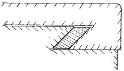

Fig. 17.20(a) View showing correctly formed dovetails, opposite sides parallel. Tapered gib piece is then symmetrical.

Circumstances sometimes demand the construction of a tapered gib to match dovetails having different angles. In other words, the scraping operator is often obliged to make the best of a bad situation. Consequently, when dovetails having a difference in angles are encountered, the tapered gib must be made to fit these diverging angles so that the members will be firmly fastened together.

This type of tapered gib is non-symmetrical and it has a transverse taper, as shown in Fig. 17.20(b) and Fig. 17.20(c). The principal fault of this construction is its tendency to slide away from the applied pressure. This would be towards surface (x) in Fig. 17.20(b). When this occurs the members will loosen. The gib shown in Fig. 17.20(c) would tend to work toward surface (y).

It is extremely difficult to produce a tapered gib of assorted angles. If, however, circumstances necessitate such an undertaking, the most satisfactory results can be obtained by the following method.

Measure the large dovetail opening and

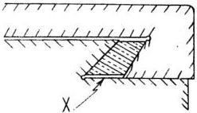

Fig. 17.20(b) View showing improperly formed dovetails, opposite sides diverge. Tapered gib piece is not symmetrical.

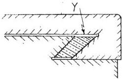

Fig. 17.20(c) View showing improperly formed dovetails. Taper of dovetail sides necessitates a transverse taper in gib piece.

145

<!-- page 12 -->

# Chapter 21

# AUTOMATIC GENERATION of GAGES

Automatic generation of gages and tools is possible only through resort to the Principle of the Symmetrical Distribution of Errors. This expression is applied to any method in precision work which results in dividing, or splitting, errors until they finally disappear. The basic principle of dividing errors is one of the oldest known in mechanics, yet is still frequently employed today. For example, it is utilized in the production of SURFACE PLATES, STRAIGHT EDGES, ANGLE PLATES, SCRAPED PARALLELS, CUBES, etc.

By the application of this principle, a high degree of precision in scraping operations is possible. In theory, splitting the error may continue until it reaches the vanishing point, and the ultimate in accuracy is achieved. In practice, however, the degree of dexterity in handling the scraping tool and the ability to make precise tests constitute limiting factors.

In the following pages are discussed not only the methods of accomplishing automatic generation of precision gages but also other matters closely related to their production. Included in this category is the special process of scraping called pin pointing. Also described are the methods usually employed in spotting, matters pertinent to selecting a proper scraper blade, and the steps in preparing suitable illumination for pin pointing work.

Sec. 21.1

Automatic Generation of Surface Plates

When there is a need to make a precision gage, say a SURFACE PLATE, two methods are feasible. One is the commonplace process of spotting on a MASTER SURFACE PLATE. Unless this tool is available to check the progress of the work, it is impossible to determine the character of the surface being scraped. Lack of such a tool, as a standard for comparison, necessitates the adoption of

the other method.

By utilizing the well known theorem "Two things equal to a third thing are equal to each other" it is possible for the skilled mechanic to prepare three metal castings and scrape them to SURFACE PLATE quality without benefit of Master Gages. Indeed when the process is completed, each casting will have been scraped to Master Quality.

If the castings are to be scraped flat and true, it is essential that the dimensions of each surface be the same or nearly so. For the purpose of this demonstration, we will assume that the three surfaces are $16^{\text{th}}$ square. If built in the customary pattern, with thick top and sturdy supporting ribs, the castings will be fairly heavy, about 70 lbs. each. This massive design is necessary to provide rigidity to the casting and strength needed for supporting the heavy weights of work pieces laid on top.

Such a casting is hard to handle, yet care in manipulating it is mandatory. It is not superfluous to caution about bumping one casting against another. This may happen during the spotting process when separating the upper from the lower plate. Damage to the castings is frequent enough to make worthwhile a detailed explanation of the cause.

For example, as the surfaces of the three plates are scraped more and more flat, there is a tendency for any two of the plates to stick together, bonded by the marking medium. An unwary mechanic lifting the top plate by the handles will simultaneously raise the lower one as well. Although the connection breaks almost immediately, the upper plate freed suddenly may tilt, even though held by the operator, and strike the lower plate causing burrs. Any practical way of anchoring the bottom plate to the bench, so that it will not lift off with the upper one, solves the problem neatly.

There are two variations in the method

175

<!-- page 13 -->

Sec. 22.17

Test for Area Contact

Whether or not a newly scraped, apparently flat surface has area contact with its mating surface cannot be detected by instruments during alignment tests. In fact, perfect though transient alignments are equally possible with members having line contact as with those having area contact.

It is the practice of some operators to probe with a .0015" feeler gage to ascertain whether there is over-all contact between the bearing surfaces but this is unsatisfactory for precision work. The only thoroughly reliable method of discovering whether two bearing surfaces have area contact or line contact is performed by utilizing a marking medium.

To provide an indicating medium, a quantity of marking compound is spread thinly on the ways of the stationary member. Then the sliding member is placed in operating position, with gib adjusted to the working pressure. By moving the sliding member by hand, or by power, from end to end on the ways, markings are produced on the slide. The marking compound coating the ways is also altered correspondingly.

By an analysis of the markings on both the ways and slides the operator can determine the condition of the bearing surfaces. A pattern of markings, uniform in coloration and overall distribution, indicates an area contact. On the other hand, a thin line of compound on the slide or a streak on the way denotes a line contact. Re-reading of Sec. 10.11 and Sec. 10.19 (Interpreting the Markings) may be helpful.

Sec. 22.18

Problem in Producing Area Contact

In order to produce area contact, bearing surfaces should be scraped so that both ways of the stationary member support a proportionate share of the weight of the mating member. The problem of achieving area contact between ways and slides involves no unusual difficulty provided the design of each set of ways (or slides) is similar. That is to say, matching two flat slides to two flat ways, or two inverted V-slides to two V-ways is a simple process of fitting. However, when the

two bearing surfaces of a member are dissimilar, a new problem is posed.

Assume for example, that we are trying to secure this close contact between the flat way and inverted V-way of a lathe bed and the flat and V-slide of a tailstock base. The solution in practice is to scrape the bed flat way level in the transverse and longitudinal directions. Concurrently, the inverted V-way of the bed is so scraped that a perpendicular line will bisect it. This method is discussed more fully in Sec. 25.16. Thus wear and pressure will be equally distributed between the flat way and both sides of the inverted V.

After the ways have been prepared as a template, the slides of the mating member, the tailstock base in this instance, can be fitted to them. This requires some care if the top of the base is not to be tilted and lose its alignment. The appropriate procedure is to scrape approximately 50% deeper on the flat bearing than on the V in order to keep the top surface of the member level. See Fig. 22.9. This technique serves to maintain the top surface in a plane parallel to the original factory surface.

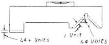

Fig. 22.9 Diagram showing necessity of heavier scraping on Flat slide than on Sides of the V. A ratio of 1.4 to 1 will maintain the top surface level while attaining bearing quality.

To accomplish this result a thickness approximating 1.4 units of metal is removed from the flat slide to every 1 unit of metal scraped from a 90° V-slide. Refer again to Fig. 22.9. The ratio would vary proportionately for V-slides of different angular value.

Sec. 22.19

Judging Bearing Quality

The appearance of a scraped surface, no matter how expertly the job seems to have been done, is no criterion by which to judge its flatness and bearing quality. It is such a simple matter to camouflage

195

<!-- page 14 -->

auxiliary parts which require adjustment etc. This part of the test card is of special interest to the mechanics who assemble the machine and give it regular maintenance inspection.

NOTE: Manufacturer's Test Record Cards are not to be confused with the operator's instruction manual which usually accompanies the machine tool. These cards are supplied by the manufacturer upon request and should be available to the scraper prior to the start of any rescraping job.

Sec. 23.28

The Test Card Explained

Test cards comprise an aggregation of diagrams, with accompanying tolerances, instructions etc., each of which represents a test which must be satisfactorily performed before the machine being tested is accepted.

Since the scraping operator will have many occasions to consult alignment test cards, it is advisable for the novice to thoroughly familiarize himself with the contours representing the various machines, the symbols and the instructions accompanying each diagram. Although the number of variations runs into many hundreds, it is impossible to discuss in this chapter more than a few typical examples. However, once the fundamentals are understood, it is a relatively easy matter to interpret the diagrams and apply the test.

Two classes of tests are incorporated in the Test Record Cards.

1. Static tests. These are made on sub-assemblies and on the completed machine without using power.
2. Working tests. As the term implies these have to do with the performance of the machine in various machining operations.

In the following paragraphs, as well as in the legends associated with the figures, the various features that make up test cards generally will be explained.

1. The most prominent feature on the test card is the diagram. As the examples in Fig. 23.11 show, it is drawn in simple form so as to illustrate in the clear-

est manner the kind of machine or member being tested. Consequently, the drawings contain a minimum of detail. Sometimes only a portion of the tool is outlined. Components not essential to comprehension are excluded. The point of view is usually stated. Incidentally, test cards issued by different factories will be found to vary in some small degree in the representation given to similar categories of machines and parts.

2. The tools and gages shown on test cards are not drawn to a perfect likeness, either as to type of form, or even as to scale. See Fig. 23.12. Furthermore, the placement of a tool or gage, or the method of clamping it, is not functionally authentic. In other words, these diagrams are merely figurative. The movement of the tool or gage or member being tested is often indicated by dotted lines denoting one of the two extreme positions to be occupied. Where the positioning of the gage could lead to confusion as to the particular part of a member to be tested, a printed explanation is always included.
3. Procedures must be significant to provide the information desired when proving the accuracy of an alignment. Fig. 23.13 shows how this is assured by means of arrows indicating the direction of movement of the testing gage, the member to which it is fastened or the component being tested. This practice is usually supplemented by printed instructions so no mistake can be made. Often where the test must be made in both the vertical and horizontal planes, this requirement is represented by drawing two gages either on or adjacent to the diagram.
4. An important feature represented on test cards is the test of components other than sliding bearings. These are allowed a maximum tolerance without reference to distance. See Fig. 23.14.
5. These cards also illustrate tests by means of which one surface is checked for parallelism with or squareness to another surface, as the case might be, with maximum tolerance allowed in a specified distance. Essentially, this category constitutes bi-lateral tolerances. See Fig. 25.15.
6. Test record cards include many ex

216

<!-- page 15 -->

amples of unilateral tolerances. Common to all of these is a maximum allowed error for a designated distance with the minimum reading or maximum reading always in a specified direction. See Fig. 23.16.

7. Test cards frequently include diagrams showing that the test is conducted within a specified length or that the testing

instrument is set to take measurements at specified positions. See Fig. 23.17.

8. Test cards frequently contain one or more working tests for a machine. These are useful as a standard to judge the accuracy of the machine tool as it cuts and shapes metal. Representative tests are incorporated in Fig. 23.18.

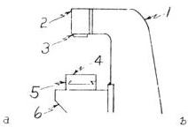

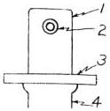

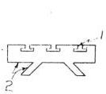

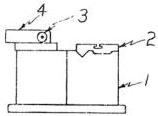

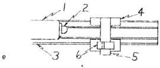

Fig. 23.11 (a) Vertical Milling Machine (Side View)

(1) Column (2) Sliding head (3) Spindle (4) Table (5) Saddle (6) Knee

(b) Horizontal Milling Machine (Front View)

(1) Column (2) Spindle (3) Table (4) Saddle and knee combined

(c) Milling Machine Table (End View)

(1) T slots (2) Slides

(d) Cylindrical Grinder (End View)

(1) Bed (2) Table (3) Wheel spindle (4) Wheel head

(e) Laine (Top View)

(1) Head stock (2) Spindle (3) Bed (4) Saddle (5) Cross slide (6) Compound rest

217

<!-- page 16 -->

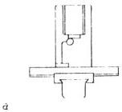

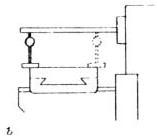

Fig. 23.12(a) Vertical Milling Machine, Spindle End Run out (Front View).

Registering cam action in spindle or bearings. DIAL INDICATOR is mounted on a substantial base or otherwise securely fastened to the table top. The button of the instrument is positioned to touch end of spindle. Deviation of the pointer is noted as the spindle is revolved.

Fig. 23.12(b) Horizontal Milling Machine, Table Top Parallel with Spindle (Side View).

Determining alignment of table top with spindle. DIAL INDICATOR measures from the front side of table top to the test bar inserted in spindle. A comparative measurement is then conducted by sliding the instrument represented by dotted lines to the back side of table top.

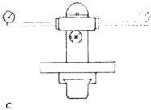

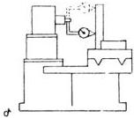

Fig. 23.12(c) Swivel Head Vertical Milling Machine, Line Up of Head Parallel to Top of Table (Front View).

Determining the accuracy of the graduations on a swivel head. The simple circle signifies that a DIAL INDICATOR is to be the measuring instrument. This gage will logically be mounted on a suitable base set on the table and moved as required. The button is adjusted to touch the vertical diameter of the test bar as the head is swiveled $90^{\circ}$ each side of zero (0). The variation in the readings as the plunger makes contact at the free end of the test bar in the two positions measures the accuracy of the graduations on the universal swivel head.

Fig. 23.12(d) Surface Grinder, Wheel Spindle Parallel with Table Top (End View).

Determining the parallelism between the wheel spindle and the work table. A square is mounted on the table top with the blade in-line with the axis of the spindle. A dial indicator is attached to the spindle by any suitable means, the extensions being made as long as possible to increase the accuracy of the test. The dotted outline denotes that the swing-round method is applied.

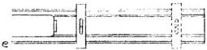

Fig. 23.12(e) Lathe, Bed Level - transverse direction (Top View).

Levelness check being made on a lathe bed in transverse direction. Though the precision level is shown only at the ends of the bed it is understood that checks are made at intermediate positions also. By comparing the readings taken at all points the degree and direction of twist is ascertained.

218

<!-- page 17 -->

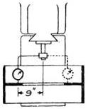

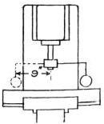

a

b

Fig. 23.15(a) Horizontal Milling Machine "Center T-slot Square with Spindle" - Max. .001" in 18" (Top View).

The dotted outline represents a swing-round test utilizing a DIAL INDICATOR fastened to the spindle. The button of the instrument is brought into contact with two parallel-sided steel plates inserted in the center T-slot of the table. Measurements are taken 18" apart after the table is centrally located.

Fig. 23.15(b) Vertical Milling Machine, "Table Top Square with Spindle" (Right and Left) - Max. .001" in 18" (Front View).

Testing alignment of table top with axis of spindle a swing-round movement of the DIAL INDICATOR is utilized to test 9" to the right and left of the spindle. To average out the irregularities a parallel sided test block is interposed between the button of the instrument and the table which should be centrally located.

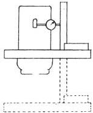

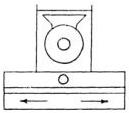

C

Fig. 23.15(c) Vertical Milling Machine, Center T-slot Parallel with Table Movement - Max. .001" in 18" (Top View).

Testing center T-slot for parallelism with the slides of the table. The DIAL is attached to the spindle with its plunger adjusted to touch the throat of the T-slot. The double arrow indicates that the movement can be in either direction with the starting point at any position allowing an 18" movement.

Fig. 23.15(d) Horizontal Milling Machine, Table Top Square with Vertical Movement of Knee in a Plane Parallel with column - Max. .001" in 18" (Front View).

Determining the alignment of table top with the guiding way of column. A DIAL INDICATOR is attached to the spindle. A Master Square is positioned on the table top with the blade of the square in contact with the plunger of the INDICATOR. The dotted outline indicates that the knee, saddle, table assembly is raised and lowered. A misalignment will be indicated by a deviation of the pointer.

221

<!-- page 18 -->

machine design for bearing surfaces. These surfaces must be aligned to each other in a definite manner, as indicated by the several OBJECTIVES. In dealing with such a construction the bearings either may be dealt with jointly, or they may be treated separately. In the latter case, one surface is finished first and then the other is aligned to it. For the purposes of this discussion, we will adopt the latter arrangement. Incidentally, it must be assumed that in this and the following problems, the casting is first leveled satisfactorily.

### Flat bearing (A)

Bearing (A) presents no special difficulty and may be spotted with either a SURFACE PLATE or a STRAIGHT EDGE, depending upon its size. It must be so scraped that a PRECISION LEVEL placed upon it, as shown in Fig. 25.23, will indicate dead level, thereby satisfying OBJECTIVE NO. 1. The flat bearing in some alignment procedures becomes the Datum Point for the V.

### The V-Template

A very effective instrument in the treatment of the V-way is a V-TEMPLATE which must be made up to the required angle. The TEMPLATE fixes the angle between the sides of the Vee. For detailed instructions on making the gage refer to Sec. 12.10.

### The V-Bearing

In treating these surfaces the TEMPLATE above mentioned and a STRAIGHT EDGE are applied alternately to spot the sides of the Vee. By this operation the

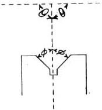

Fig. 25.24 Diagram showing the ideal form of V-way with a vertical line bisecting the V angle. Achieving this condition permits each side of the V to support an equal load.

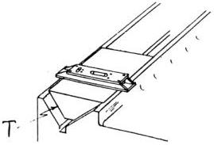

Fig. 25.25 Method of proving by means of a V-TEMPLATE and PRECISION LEVEL that V-way is bisected by an imaginary vertical line.

(T) Template

TEMPLATE determines the angle between the sides as represented in Fig. 25.24, and the STRAIGHT EDGE helps develop flatness.

To prevent the V from tilting, which in effect would cause one side to support more than its proportionate share of the weight of the sliding member, we must check frequently for OBJECTIVE NO. 2. To make the test the TEMPLATE is placed in the V and a PRECISION LEVEL is set on it as shown in Fig. 25.25. If the bubble in the glass vial centers, the OBJECTIVE is attained.

Simultaneously, a check is made for levelness in the longitudinal direction by turning the PRECISION LEVEL $90^{\circ}$ to its former position. If the bubble again centers in the vial, OBJECTIVE NO. 3 is fully realized.

Another method of testing for levelness longitudinally is shown in Fig. 25.26. A cylindrical, precision ground test bar is inserted in the V and the LEVEL is held on top. If the position of the bubble is centered, the bearing is level longitudinally. Continue scraping on the V until this condition is achieved.

OBJECTIVE NO. 4 supplements OBJECTIVE NO. 3. In this case, the set up requires laying a cylindrical test bar in the V, as represented in Fig. 25.27. A Surface Gage with attached DIAL INDICATOR is placed on the flat bearing and readings are taken at both ends of the test bar, specifically at points (M) and (N). Identical readings indicate that the bearing surfaces are parallel in the vertical plane.

243

<!-- page 19 -->

nary case, we assume that the tailstock spindle and housing are in good condition. The problem initially confronting us will be to scrape the bottom surface of the tailstock top to a correct alignment with the axis of the spindle.

Sec. 26.51

OBJECTIVES: The BOTTOM SURFACE of the Tailstock Top

1. To be parallel to the axis of the ram in the vertical plane.
2. To be parallel with the original factory plane.
3. To have a surface quality of 5 - 15 bearing spots per square inch.

# PROCEDURE:

The scraping operation on the bottom surface of the tailstock top is a relatively simple one. Spotting for its part, can be most easily performed with a SURFACE PLATE.

To check for OBJECTIVE NO. 1 the tailstock top is laid on a SURFACE PLATE with the bottom surface in contact. The tailstock spindle is then extended and clamped. By the way, all alignment tests involving the tailstock spindle are conducted with this member clamped. Clamping stress will always influence the position of the ram.

Next, using a Surface Gage and attached DIAL INDICATOR, measurements are taken at both extremities of the ram on the vertical diameter, as for example at (a) and (b) in the set up shown in Fig. 26.43. When a zero-zero reading is obtained at both positions, the bottom surface is parallel with the axis of the ram, fulfilling OBJECTIVE NO. 1. Scraping should be continued until this condition is achieved.

If removal of metal is executed "straight down" a surface is produced that is parallel with the original factory plane, satisfying OBJECTIVE NO. 2.

# CAUTION:

Exercise care in scraping along the edges of the transverse slide (3).

With the attainment of all three OBJECTIVES, simultaneously, the tailstock top is completed.

Sec. 26.52

The Tailstock Base

This unit consists of three surfaces which are scraped. They are enumerated as follows:

1. The V-slide
2. The flat slide
3. The top surface

The underneath bearing surfaces were shown in Fig. 26.22. Fig. 26.44 illustrates the top surface.

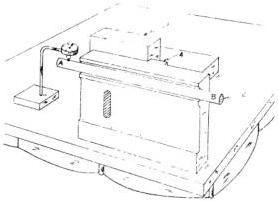

Fig. 26.45 Method of testing V-slide of tailstock base to be square with transverse way.

(1) angle plate (2) cylinder (4) transverse way

As the reader will no doubt recall, the V-slide and the flat slide have already been scraped and prepared as a template for spotting the inside ways of the bed. Some minor adjustments may now be necessary to convert the tailstock base from its present status as a mere template, to its proper and ultimate function as an integral part of the lathe. That in brief is the purpose of the next series of operations.

Sec. 26.53

OBJECTIVES: The V-SLIDE and FLAT SLIDE of the Tailstock Base.

1. V-slide to be square with transverse way on the top surface.
2. V-slide and flat slide to be parallel, in the vertical plane.
3. To be fitted to the bed ways with a surface quality of 10 - 15 bearing spots per square inch.

293

<!-- page 20 -->

to indicate levelness. When the need for it is indicated, shims are driven under one or more corners of the base. Incidentally, it is essential that an instrument of at least ten seconds accuracy be used for leveling operations on this casting. Leveling of all machine tools should be conducted with an instrument having an accuracy commensurate with the required precision.

Sec. 27.35

Confirming the Alignments

After leveling the column, the knee member is positioned on the elevating screw and the elevating hand wheel is attached. The gib brackets are bolted to the knee. Next the tapered gib is inserted and adjusted for sliding pressure by moving the knee up and down the column. At this time, with the column erected and leveled, and the knee in operating order, the final Alignment Tests for the knee should be conducted.

Fig. 27.36a shows the method of testing the alignment of the flat way of knee to face of column. The permissible tolerance is indicated in Fig. 27.36b.

In Fig. 27.37a is shown the set up for testing the alignment of flat way of knee to guiding way of column. Fig. 27.37b represents the allowed tolerance.

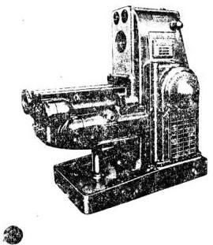

PLATE 43. Knee unit mounted on column - horizontal milling machine. (Courtesy - Kearney & Trecker Corp.)

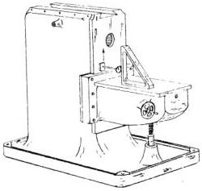

Fig. 27.36(a) General arrangement for testing alignment of flat way of knee to face of column

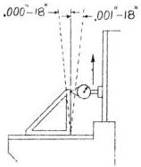

Fig. 27.36(b) Flat way of knee to be square with column face. Tolerance max. .001' in 18'. (Low point at rear)

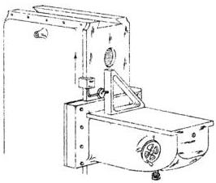

Fig. 27.37(a) Method for testing alignment of flat way of knee with guiding way of column.

343

<!-- page 21 -->

# Chapter 28

# THE VERTICAL MILLING MACHINE

The vertical milling machine falls into two principal classifications, viz:

1. The Sliding Head Vertical Miller, wherein the head is adjustable in a vertical direction while the axis of the spindle remains in a vertical plane.
2. The Swivel Head Vertical Miller, wherein the head is held at a fixed height but is free to swivel, thereby allowing the axis of the spindle to be in any plane between vertical and horizontal.

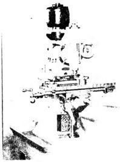

PLATE 53. Vertical milling machine with swivel head. (Courtesy - Elgin Tool Works.)

In the following pages a vertical milling machine utilizing the Sliding Head will be discussed. Fig. 28.1 shows such a machine completely assembled. This familiar machine tool has many points of similarity to a horizontal miller but it also has other distinctive features which are peculiar to it alone, and therefore of special interest to the scraping operator. For this reason, a detailed description of the problem and the procedure involved

in reconditioning the Vertical Miller is justified.

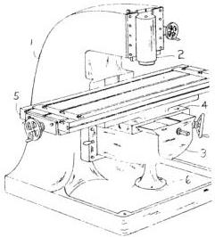

Fig. 28.1 Assembled Vertical Milling Machine showing principal parts.

(1) column (2) sliding head (3) knee (4) saddle
(5) table (6) pedestal and boss

# Sec. 28.1

The Sliding Head Vertical Milling Machine

The sliding head vertical miller described and illustrated in this chapter, combines the structural design found on popular models of several manufacturers. One notable difference between the elementary form shown in Fig. 28.1 and the one illustrating the horizontal miller in Fig. 27.1 will be readily apparent. This machine utilizes dovetails on most of the principal members, whereas the example demonstrating the horizontal miller consists mainly of square edges. As a result, scraping methods vary as between machines, although the alignment tests, and the requirements thereof, are somewhat similar. The reason for varying the type of bearing surface is to provide information in treating a variety of bearing surfaces.

393

<!-- page 22 -->

traces of irregular table motion and is required for machines such as thread grinders or roll grinders. The wheel head slides and dressing tool slides of thread grinders may also be mounted on rollers.

On some machines the rollers bear directly on cast iron surfaces. On other machines, the rollers bear against hardened, steel inserts, fastened to the iron surfaces. These surfaces must always be scraped flat and true upon reconditioning if the slightest warp is present. New and straight inserts are then attached.

Circular ways designed to carry the load of horizontal rotary tables are also made. These ways are usually flat since the alignment of the table is controlled by a central spindle.

The kinds of jobs performed on precision grinders is not a proper subject for this book. However, it may be interesting to point out that grinding, to maintain tolerances of plus or minus .0005' is common in everyday production. For very special work, designers have produced modern grinding machines that can achieve an accuracy so exact, that to express it, a new term "micro-inch" (one millionth part of an inch) has been coined. This measurement is now familiar in some industries where special devices for testing have been developed.

To produce this extreme accuracy, grinders are being made heavier to absorb vibration, and more strongly ribbed to give increased rigidity to the machine. Every part that turns or slides receives the most exacting attention so that when these machines are completed at the factory they are the ultimate in accuracy and perfection. The ways and slides of these machines are as flat and as parallel as it is possible to make them. This perfection is of special interest to the scraping operator because it is his problem, in reconditioning the machine, to restore the bearing surfaces to their original accuracy.

Besides the worn flat bearings there are other factors involved in the reconditioning process which if not corrected could aggravate existing defects or even induce new errors. These include worn or defective gearing, feed screws, spindle, spindle bearings etc. The specific treatment required to restore these components

ents to their original accuracy is beyond the scope of this book and therefore will not be treated except in the briefest manner when special circumstances warrant it.

The varieties of grinding machines are so numerous that it would require several volumes to describe separately, the reconditioning processes on each type. They are separable, however, into two general classifications according as to whether they grind cylindrical surfaces, or grind flat surfaces.

To explain the scraping and aligning procedure on the general group of cylindrical grinders, we have selected a Cylindrical Grinder with Universal Workhead as typical of the class. This choice was made because it is a well known, widely used machine. For this demonstration, as in previous ones, an elementary form will again be used.

In order to have the scraping procedure in harmony with conditions as they are found in most shops, we will use the fewest possible number of spotting or testing gages. Reliance will be placed in the few standard tools found in average shops, and when practicable, in the components of the machine employed as Templates.

# Sec. 29.1

The Cylindrical Grinder: Components

The cylindrical grinder, illustrated in Fig. 29.1, consists of five members which are the prime concern of the scraping operator. In addition to the fundamental components enumerated below, the grinding machine is often equipped with special attachments which greatly increase the versatility of the machine. The methods of reconditioning these minor parts will not be discussed. When such work is called for, it is thought that the principles and practices recommended for treatment of the various standard parts will, if thoroughly understood, be entirely adequate to cope with this auxiliary equipment.

1. The Bed (1). The main casting of the cylindrical grinder is called the bed. It is a large, heavy casting made of a good grade of cast iron or semi-steel. It is substantially ribbed to provide a rigid foundation for the other

443

<!-- page 23 -->

wheelhead housing. Otherwise two bushings must be made up (preferably hardened and ground to a light press fit) and inserted in the hole in the housing. The sole advantage of the latter course is that it reduces the size of the hole and thereby permits the utilization of hollow tubing or bar stock having smaller diameter.

The test bar made in one of these two forms (hollow or solid) is then ground for a sliding fit with the hole in the wheelhead housing. In either case, the test bar should be provided with a target length of 8" to 12" to make it useable for subsequent checks on other members.

To execute the test, the right hand slides of the member are placed on two identical PARALLELS laid side by side on a SURFACE PLATE. The test bar is inserted and positioned centrally in the spindle hole or in the bushings, as the case might be. Using a Surface Gage and attached DIAL INDICATOR for the purpose, measurements are made from the PLATE to the vertical diameter of the test bar adjacent the spindle cartridge hole at front and rear, as shown in Fig. 30.6. A tolerance of .0003" is permissible.

Scraping is continued on this surface until the slides are fitted to the right hand upright ways with a surface quality equal to that specified in OBJECTIVE NO. 2.

Both OBJECTIVES must be realized jointly.

Sec. 30.17

OBJECTIVES: The left hand (gibbed pair) slides of the wheelhead housing.

1. To be parallel with the right hand (guided pair) slides of the member.
2. To have a clearance of .003" between the inner ways of the upright.
3. To have a surface quality of 10 - 15 bearing spots per square inch.

# PROCEDURE:

The question of clearance should be the first matter investigated because the original factory-new condition no longer exists. Having removed metal from the inner ways of the upright and from the right hand slides of the wheelhead housing, we have created a situation where the housing will be too loose if inserted under present circumstances.

To take up excess slack and provide just the right amount of sliding clearance between the wheelhead housing and the inner ways of the upright, it is standard practice to fasten steel straps usually 1/8" (.125") thick to the left hand slides, securing them with countersunk 10-32 flat head screws.

Preliminary to fastening these steel straps, sufficient metal must be removed from the left hand slides of the housing to properly accommodate them. One competent method of accomplishing this is to mount the housing on a milling machine table and mill away the surplus thickness. Naturally, this is not a haphazard operation. The steps required for calculating the depth of the milling cut are enumerated below.

1. Measure the distance between the right and left hand slides of the wheelhead housing using an outside micrometer. Example - 5.000"
2. Measure the distance between the right and left hand scrape-finished inner ways of the upright, employing for this purpose an inside micrometer. Example - 5.010"
3. Clearance between members now amounts to .010".
4. Clearance for efficient operation should be only .003".
5. Excess clearance under current conditions equals .007".
6. Thickness of steel strap to be attached is, say, .125".
7. Thickness of metal to be removed from left hand slides of housing is calculated as - .125" minus .007" equals .118".
8. Allowing .005" for purposes of developing a good bearing on the steel straps, by scraping or grinding, the depth of the milling cut should be limited to - .118" minus .005" equals .113".

(The problem is shown diagrammatically in Fig. 30.7a and Fig. 30.7b)

After the slides are properly milled, drilled and tapped and the steel straps attached, spotting and scraping operations are begun with a view to satisfying all three OBJECTIVES simultaneously.

A SURFACE PLATE should be used for spotting. It will facilitate matters if a second PLATE is available to conduct

493

<!-- page 24 -->

# CAUTION (cont'd.)

on grinding practice. Another reason for the failure may be attributed to warping of the carriage member. It is well to investigate whether a bolted part, a splash guard for example, may not be the origin of the trouble. The strain imposed by such an auxiliary part may appreciably affect the sensitive alignments of precision surface grinding machines.

As explained previously in Sec. 30.28, aligning the T-slots to table movement may be accomplished in either of two ways. It can be done either by scraping underneath slides of the table so as to "throw" the T-slot in the proper direction, or by grinding the T-slots in place.

In the sequence being followed the slides of the table have been scrape-fitted and we may, therefore, assume that the alignment required by OBJECTIVE NO. 3 has been fulfilled. However, in case the fitting was done without regard for this requirement, the alignment specified in OBJECTIVE NO. 3 can now be attained only by grinding the T-slots in place. Of course, the throats of the T-slots must be ground parallel their entire length.

Before undertaking this operation determine the amount of misalignment by repeating the test described in Sec. 30.28. A tolerance of .0002" per foot is allowable (with the T-slots finish-ground).

# NOTE:

Any grinding of the throats of the T-slots will necessitate altering the tongues of all fixtures.

# Sec. 30.30

OBJECTIVE: The Magnetic Chuck of the surface grinder.

1. To be parallel with the table top.

# PROCEDURE:

Strictly speaking, the magnetic chuck is not a part of the plain surface grinder, but inasmuch as it is a commonly used auxiliary and inasmuch as the reconditioning procedure can be described briefly, it will be included in the sequence, as follows:

The magnetic chuck is inverted on the table top and the base ground. Then the member is placed in operation on the table top and clamped lightly in place. Next utilizing a DIAL INDICATOR, the front of the chuck is aligned parallel with the table travel, whereupon the member is tightly clamped. The working surface of the magnetic chuck is now ground in place. This operation is performed in the "on" position, that is, with the chuck magnetized.

The accuracy of the grind will be tested by grinding sample work pieces to be described later.

# CAUTION:

As sometimes happens, a faulty chuck may be encountered in which case its working surface cannot be ground flat. If all other possible sources of trouble have been investigated and eliminated, it is advisable to substitute another magnetic chuck and repeat the grinding process.

# Sec. 30.31

Working Test.

After the magnetic chuck is finish-ground, sample pieces should be ground to determine the working accuracy of the machine. To this end small blocks of hardened tool steel are spaced across the chuck to cover a representative portion of its surface. They are ground on one side, inverted and shifted to a corresponding position on the opposite side of the chuck and ground again. This transfer will expose the blocks to the maximum error present. After grinding both sides, the test pieces are measured for parallelism.

The average plain surface grinder used in the tool room should be able to size these work pieces as to thickness and parallelism on a rough grind within 0.0003" and on a finish grind within 0.0001" over a working area of approximately one (1) square foot.

# STATIC ALIGNMENT TESTS

If the results of the Working Test just concluded fall short of the established standards of Working accuracy, the origin

513

<!-- page 25 -->

minor axes of rotation of a test bar.
mean position: The average eccentricity
error.

method: A systematized procedure.

micrometer, vernier: A micrometer
calibrated in tenths of thousandths
of an inch.

milling machine: A machine tool wherein
the work is shaped by means of a
rotating multiple tooth cutter tool.

mount: Affix to or position upon, as a
carriage mounted on a lathe bed.

obtuse angle: An angle greater than 90°.

O. D.: Abbreviation for outside diameter.

off-hand scraping: A procedure per-
formed without alternate spottings
of the work surface, consequently
faster but less accurate, never
feasible except where a large ex-
cess thickness of metal provides a
reasonable margin of safety.

oilstone: A bench stone for sharpening
tools, oil being the lubricant.

on center: A condition wherein the cutting
edge of the tool is at the same level
as the axis of the centers. If higher
or lower it is above or below center
respectively.

ooze: To spread or run, as compound
under pressure.

operator: The mechanic performing the
scraping work or conducting align-
ment tests.

out of round: A shop term signifying that
a shaft is not truly circular.

over arm: On a milling machine, the
horizontally adjustable brace above
the spindle which supports the arbor.

overhaul: To recondition, as to repair a
machine.

parallax: The apparent displacement of
the bubble in a vial of a precision
level when viewed from two differ-
ent points.

parallel: Equally distant in all parts, as
parallel lines or parallel planes. In
alignment work, tests are made for
this quality in both horizontal and
vertical planes, measurements
being made longitudinally or trans-
versely as convenient.

parallels: Hardened and ground or hand
scraped steel bars used to support
work. Thus a work piece placed
on two identical parallels is parallel
to the base supporting the tools.

particle: A small bit of matter, a piece
of grit.

pattern: A copy; model.

peen: The rounded end of a hammer op-
posite to the face.

periphery: The circumference of a cir-
cular object or part, particularly
one that rotates.

pitch: The distance from a point on a
screw thread to a corresponding
position on an adjacent thread
measured parallel to axis of a
shaft.

pivot joint: The highest part of a convex
surface on which a spotting tool
will teeter if balanced; a fulcrum.

plane: A surface without elevations or
depressions.

planer: A machine tool capable of ma-
chining flat surfaces of large size.
The work is fastened to a moving
table and is passed under station-
ary cutting tools.

practice: A procedure; a proved method;
a systematized routine.

precision: High accuracy that conforms
to established standards.

prismatic way: An inverted V-way, as
on some forms of lathe bed.

protractor: A tool usually equipped with
a vernier scale, for measuring
angles or laying out work.

push fit: A condition wherein a male part
can be pushed into a female part
by hand pressure.

ram: A retractable cylinder of a lathe
footstock into which the dead center
is inserted.

reading: A measurement, as a position
on a calibrated dial face indicated
by a pointer hand.

recondition: renovate, to restore to a
good condition.

rectify: To set right; to correct; to
make accurate.

red lead: A reddish-orange oxide of lead
which ground to a fine powder and
mixed with oil makes an effective
marking compound.

register: To record, to indicate a read-
ing on a test instrument.

repair: Put in good operating order;
replace worn parts.

resultant: two or more requirements to
be accomplished in a single opera-
tion.

revolve: To turn, as a shaft.

523
