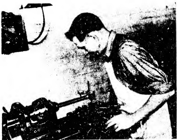
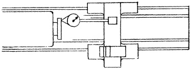

PLATE 32. Inspector testing alignment of headstock spindle with test bar inserted in tapered hole. Readings are taken from DIAL INDICATOR mounted in lathe tool post. (Courtesy - South Bend Lathe Works.)

Sec. 26.62

## Spindle Taper Runout (4th test)

There is a double purpose in conducting this test, namely:

1. To assure that the test bar is properly seated in the tapered hole of the spindle. It is necessary to know this so that readings obtained subsequently in aligning the headstock may be depended upon. In other words, the operator must be certain that the test bar when seated contributes no error to the readings which is not accounted for. (See Sec. 15.7 Sag in Test Bars)

2. To check the concentricity of the taper hole with the spindle axis. Incidentally, the concentricity is more accurately gaged by this set-up than by the test for Spindle Center Runout, due to the greater extension of the test bar.

We will now prepare the necessary ap\-paratus for checking these two conditions.

A test bar is made up with a taper on one end to fit the tapered hole in the spindle. In making the bar, the straight portion should be proportioned to the size of the lathe and therefore will vary in length and diameter.

Before the bar is to be used its accuracy should be verified by mounting between centers and testing for concentricity. (See Sec. 15.1)

Next the bar is inserted into the tapered hole of the spindle. After mounting a DIAL INDICATOR on the carriage, the button is brought to bear against the test bar at say the vertical diameter. As the spindle is slowly revolved, readings are taken at both ends of the bar in turn. The readings obtained must be within the limits permitted, as indicated in Fig. 26.58. If this is accomplished, the test bar is known to be accurately seated in the spindle tapered hole.

Fig. 26.57 Cam action of spindle

## RECOMMENDED STANDARDS

Tool Room 12" to 18" inc. 20" to 36" inc.

Lathes Engine Lathes Engine Lathes

(Total indicator reading with instrument on rear side of test plate)

0 to .0003" 0 to .0005" 0 to .00075"

Difficulty in accomplishing a zero-zero reading may be traced to grit or dust particles adhering to the surfaces. The safe practice is to clean the tapered hole with a cloth and stick. Never insert a finger in a revolving spindle.

As to the second consideration, the tapered hole must also be concentric with the axis of the spindle, within the tolerance indicated in Fig. 26.58. If the tolerance is exceeded there are several possible causes therefor.

To fix responsibility, the tapered section of the test bar should be examined to determine if the taper matches the spindle hole. This operation is easily performed by spreading a thin film of marking compound in a narrow streak, lengthwise on the tapered portion of the bar. By inserting the bar in the spindle hole and wringing it, some of the compound is transferred. Examination of the bar after