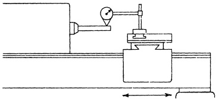
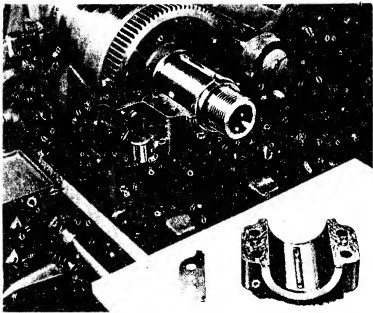

RECOMMENDED STANDARDS

spindle taper runout test is conducted. This requires the test bar to be inserted into the headstock spindle. Incidentally, a runout test must be performed each and every time the test bar is removed and re-inserted to prove the truth of the seating. To nullify the effect of eccentricity error, the mean position is located at the vertical diameter for this portion of the test.

Now returning to the alignment we will mount a DIAL INDICATOR on the carriage. The button of the instrument is piaced at the vertical diameter of the test bar. Next the carriage is moved and a reading is taken between the spindle nose and the free end of the test bar. The amount of misalignment of the spindle to the bed ways in the vertical plane is thereby noted. This information relates to the first portion of OBJECTIVE NO. 1.

A similar preliminary check for OBJECTIVE NO. 1 in the horizontal plane is also necessary. This requires finding the mean position of the test bar and turning it to the horizontal plane. Then the button of the instrument is set at the near side of the test bar i.e. the horizontal diameter, as shown in Fig. 26.60. Again the carriage is traversed and the reading is recorded.

Fig. 26.59 Alignment of head stock spindle in vertical plane.

Recommended Standards

Tool Room 12" to 18" inc. 20" to 36" inc.

Lathe Engine Lathe Engine Lathe

0 to .0005" 0 to .001" 0 to .001"

(high at end of 12" test bar)

These two tests will provide necessary information as to the degree of misalignment now existent in the headstock spindle with respect to the DATUM PLANE i.e. the outside inverted V-ways of the bed. This data refers only to OBJECTIVE NO.1.

Inasmuch as all three OBJECTIVES must be attained simultaneously, it is important to know at this stage, before any scraping is attempted on the headstock slides, the approximate misalignment in the vertical plane of the headstock spindle with respect to the axis of the tailstock spindle. Since the headstock surfaces have not as yet been treated, it is obvious that the axis of the headstock spindle is higher from the bed ways than the axis of the tailstock spindle, which member has been scrape-finished. We determine approximately how much metal to remove from the headstock V-slide and flat slide by executing the following procedure:

Sec. 26.64

Vertical Alignment of HEAD &TAIL

CENTERS

The necessary equipment for this operation includes a test bar of a different type than those previously used. A hardened steel cylinder of suitable length, centered at both ends and then accurately ground to one appropriate overall diameter will be required. It will be mounted between the lathe centers during the test.

PLATE 34. Close-up of headstock with spindle bearing cap removed to show how surface of headstock and bearing cap are hand scraped and fitted together. (Courtesy - South Bend Lathe Works.)

To facilitate the test for vertical alignment it is necessary to adjust, as closely as possible, the axis of the tailstock spindle in-line with the axis of the headstock spindle in the horizontal plane. The preliminary adjustment is accomplished by the following set up:

After fastening a DIAL INDICATOR to the carriage the contact button is