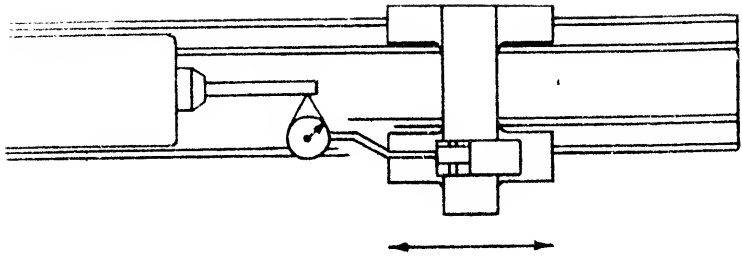
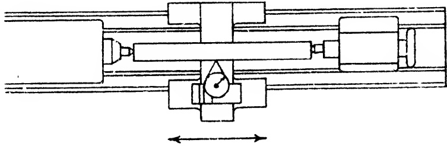

Fig. 26.60 Alignment of head stock spindle in horizontal plane.

<!-- скан таблицы: imgs/tbl_p0007_220_599_982_832.jpg -->
<table border=1 style='margin: auto; word-wrap: break-word;'><tr><td colspan="4">RECOMMENDED STANDARDS ⚠</td></tr><tr><td style='text-align: center; word-wrap: break-word;'>Tool Room</td><td style='text-align: center; word-wrap: break-word;'>12&quot; to 18&quot; inc.</td><td style='text-align: center; word-wrap: break-word;'>20&quot; to 36&quot; inc.</td><td style='text-align: center; word-wrap: break-word;'></td></tr><tr><td style='text-align: center; word-wrap: break-word;'>Lathe</td><td style='text-align: center; word-wrap: break-word;'>Engine Lathe *</td><td style='text-align: center; word-wrap: break-word;'>Engine Lathe</td><td style='text-align: center; word-wrap: break-word;'></td></tr><tr><td style='text-align: center; word-wrap: break-word;'>0 to (±) .0003&quot;</td><td style='text-align: center; word-wrap: break-word;'>0 to (±) .0005&quot;</td><td style='text-align: center; word-wrap: break-word;'>0 to (±) .0008&quot;</td><td style='text-align: center; word-wrap: break-word;'></td></tr><tr><td colspan="4">(At end of 12 inch test bar)</td></tr></table>

placed on the horizontal diameter of the test bar, as shown in Fig. 26.61. The carriage is now moved so that the button slides from end to end of the bar. At the same time the tailstock top is set-over on its transverse way until a reading close to zero-zero is attained. We say “close” because at this stage we would not obtain an identical calibration in traversing the test bar from end to end due to the fact that the axis of the headstock spindle is higher than the axis of the tailstock spindle. The reason, as previously stated, is that no scraping has yet been done on the slides of the headstock. Consequently, the DIAL INDICATOR button would ride up or down from the horizontal axis of the test bar as the carriage is moved along the bed ways.

Having adjusted the bar closely, we can proceed to check the vertical alignment. To this end the DIAL INDICATOR is positioned on the vertical diameter of the test bar, as shown in Fig. 26.62. Readings are now taken as the carriage is moved along the bed. The results of this test indicate approximately how much metal must be scraped from the bearing surfaces of the headstock to obtain correct alignment and satisfy OBJECTIVE NO. 2.

After the approximate amount of re-

quired correction is learned from this

series of tests, spotting and scraping

Fig. 25.61 Set up utilized to adjust headstock and tailstock centers in horizontal plane.

operations can be initiated. The head-stock is placed carefully on that portion of the bed ways previously coated with marking compound. Then after spotting, the member is removed from the bed and laid on a work bench where it is scraped. Since it is unlikely that a single cycle of spotting and scraping will accomplish the alignments specified in OBJECTIVES NO. 1 and NO. 2, it will be necessary to repeat the foregoing series of tests a number of times. As the alignment approaches the required accuracy, the adjustment of the tailstock in the horizontal plane will be progressively smaller. The need for it will end when the DIAL INDICATOR reading nears zero-zero on both the horizontal and vertical diameters.

When the tests disclose that the correct alignment is imminent, the desired bearing quality is worked into the headstock V-slide and flat slide, to satisfy OBJEC-TIVE NO. 3. Refer to Sec. 23.25. Simultaneous Achievement of Bearing Quality.

If the tolerances indicated in the tests above mentioned, are not exceeded in the final alignment of the headstock spindle, then the three OBJECTIVES are satisfied and the headstock member is considered completed. However, if during the course of trying to obtain the OBJECTIVES, the scraper should remove too much metal from the slides, thus lowering the axis of the headstock spindle below the axis of the tailstock spindle, it is obvious that OBJECTIVE NO. 2 cannot be satisfied.

Faced with this dilemma, the scraper should continue scraping until OBJECTIVES NO. 1 and NO. 3 are achieved at which moment the headstock is adjudged completed. OBJECTIVE NO. 2 is disregarded.

The matter of the vertical alignment cannot, however, be dismissed. Rectification, in such cases, is obtained by returning to the tailstock. The slides of this member must be reworked, to satisfy all the OBJECTIVES listed in Sec. 26.55, plus this additional one, viz:

“Axis of tailstock spindle to be aligned to axis of headstock spindle in the vertical plane.”

When these objectives are satisfied then both of the members are correctly aligned, to each other and to the bed ways. Thus the accuracy of the lathe is in nowise impaired by failure or inability to achieve alignment by means of the headstock.