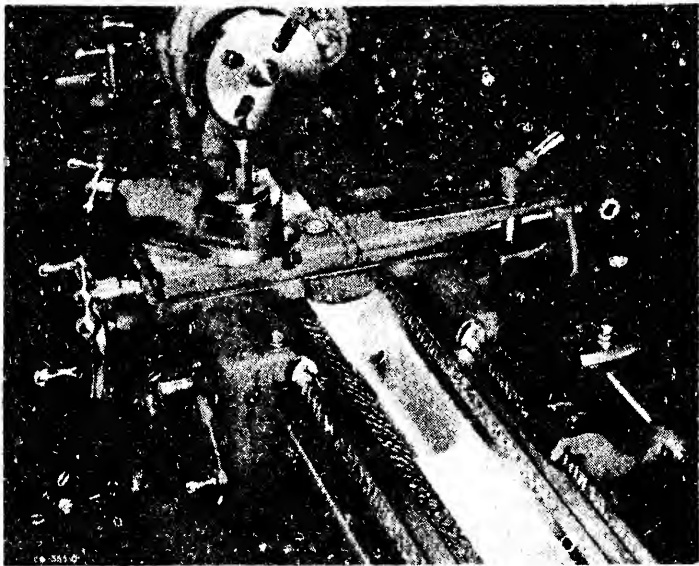

The correct alignment can still be obtained by reworking the slides of the tailstock.

There is an alternative method of checking the alignment of the axis of headstock spindle to axis of tailstock spindle in vertical plane, as specified in OBJECTIVE NO. 2. The principal advantage of this system is that alignment of the axes of the two centers in the horizontal plane is not required. Another advantage in substituting it is that checking the alignment after each scraping cycle can be done more speedily. A further advantage of the method is that the exact degree of misalignment can be ascertained, not just the approximate amount.

The necessary apparatus for applying the method includes a DIAL INDICATOR mounted on the cross-slide on the carriage. Two precision ground test bars of identical diameter and length are also used. One is inserted in the spindle of headstock, the other is inserted in spindle of tailstock. Both bars are given their usual tests for proper seating, runout etc. Then the button of the DIAL is adjusted to the vertical diameter of each bar at the free end in turn. This can be done without changing the setting of the instrument by moving the cross-slide out and in. Readings are taken which, if within the tolerance allowed, signify that the axis of both spindles are truly aligned in the vertical plane.

## NOTE:

During the course of aligning other components of the lathe, the movable members will many times be slid back and forth on the ways of the bed. This causes isolated high spots which previously escaped notice to become sharply defined. Therefore, when all alignments have been completed on the other members, it is good practice to give the bed ways a final touching up to improve the wearing quality, that is, to make it more lasting. (Refer to Sec. 19.12)

Bronze Bearings in Spindles

As a general rule, the slides of the lathe headstock do not wear or warp since the member is bolted solidly to the bed. Consequently, treatment of these surfaces is necessary only for alignment purposes. That is, as the discussion in Sec. 26.63 and Sec. 26.64 has shown, the axis of the headstock spindle must be parallel horizontally and vertically to the bed ways and in-line with the axis of the tailstock.

If the headstock spindle has bronze bearings it is practicable to secure these essential alignments by scraping the round bronze bearing instead of the flat slides. This operation is performed with the head stock bolted to the bed ways. Scraping is done with a round-scraper. The several alignment tests are executed periodically.

Sec. 26.65

Final Alignment of the Carriage Ways

The OBJECTIVES which were sought in scraping the compound slide rest and the carriage were designed so that the member would be correctly aligned to the headstock spindle. How exactly the work was done will be determined by the following alignment test.

PLATE 35. Close-up of lathe carriage and headstock showing how the units are aligned on the lathe bed by inverted V-ways which are hand scraped straight and parallel. Note taper attachment at right side of illustration. (Courtesy South Bend Lathe Works.)

## OBJECTIVES: The FINAL ALIGNMENT of the CARRIAGE WAYS to the AXIS of HEADSTOCK SPINDLE

1. Cross slide movement to be square with axis of headstock spindle.

2. Flat ways to be level, longitudinally and transversely.

3. Carriage V-slides to be fitted to bed ways with a surface quality of 10 - 15 bearing spots per square inch.