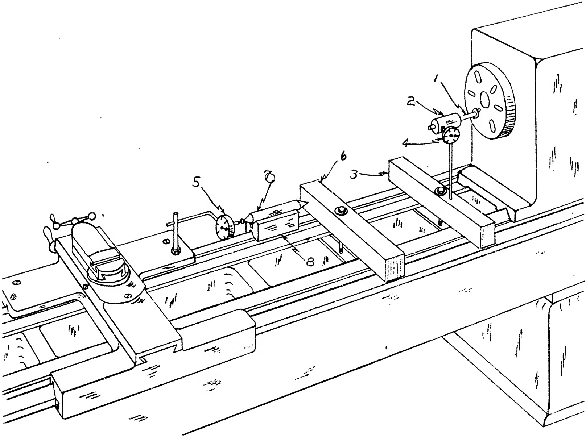

Fig. 26.70(a) Testing pitch error in Lead Screw by comparison with End Gage. 1st phase Starting Position.

(1) ground stud (2) sleeve (3) parallel bar (4) DIAL INDICATOR (5) DIAL INDICATOR (6) parallel bar (7) end gage (8) precision V-block.

be either more or less than 12" and this difference when measured will be the pitch error.

In practice, the spindle is revolved ninety five times and as the last turn begins, the sleeve is inserted on the stud. The ninety sixth revolution is completed when the reading on the INDICATOR (4) attains the same value as previously recorded. At that point further movement should be stopped.

We now turn to the INDICATOR (5). The button of this DIAL should be in contact with the stop (6). What ever the difference between the first reading which was jotted down and the present reading will constitute the pitch error of the lead screw in thousandths of an inch per foot, either plus or minus.

#### Sec. 26.73

Limitations Affecting the Accuracy of Static Alignment Tests.

With the lathe completely assembled it is well to try the lathe under actual operating conditions. Up to this point we have depended principally upon a DIAL INDICATOR to inform us as to the accuracy of our alignments. Furthermore, no working pressure has been applied to the bearing surfaces. However, we may feel reasonably certain that the machine will produce accurate work, provided the following conditions were fulfilled, namely:

1. If an accurate, sensitive DIAL INDICATOR was used.

2. If testing set-ups were made accurately.