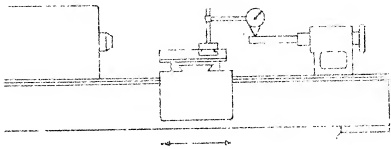
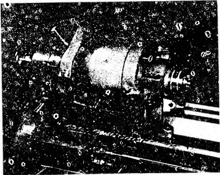

tapered hole in the spindle is “in-line” with the axis of the spindle in the vertical plane. The only change required for the set up in this test from the previous one, is to locate the DIAL button at the top of the test bar at the vertical diameter. A reading is taken as the carriage is traversed. If the unilateral tolerance indicated in the recommended standards is not exceeded, then the axis of the tapered hole is “in-line” with the axis of the spindle in the vertical plane.

In case the two tests show that the tapered hole is inaccurate and exceeds the limits allowed, the spindle must be removed from the tailstock. It must then be replaced with a new and accurate spindle. In lieu of this, the tapered hole of the defective spindle can be reworked. However, since this matter pertains to machine shop practice it will not be further discussed.

To reassure the critical reader, it will be emphasized that, finding a tailstock spindle with a defective tapered hole will not affect the alignment of the previously scraped bearing surfaces of the tailstock. Replacement of the spindle or reboring the taper hole will, however, be called for.

#### Sec. 26.57 The Head Stock of the Lathe

The fixed member of the lathe which carries the work spindle supporting the live center, and the necessary mechanism to drive the work, is called the head stock. It is a solid one piece casting, as shown in Fig. 26.54. The member has two bearing surfaces which are scraped, namely:

Fig. 26.53 Alignment of taper note of tarsock in vertical plane.

<table border=1 style='margin: auto; word-wrap: break-word;'><tr><td colspan="4">RECOMMENDED STANDARDS</td></tr><tr><td style='text-align: center; word-wrap: break-word;'>Test Room</td><td style='text-align: center; word-wrap: break-word;'>12&quot; to 15&quot; (m.</td><td style='text-align: center; word-wrap: break-word;'>25&quot; to 35&quot; (m.</td><td style='text-align: center; word-wrap: break-word;'>100</td></tr><tr><td style='text-align: center; word-wrap: break-word;'>Lakes</td><td style='text-align: center; word-wrap: break-word;'>Engine: Lakes</td><td style='text-align: center; word-wrap: break-word;'>Engine: Lakes</td><td style='text-align: center; word-wrap: break-word;'>100</td></tr><tr><td style='text-align: center; word-wrap: break-word;'>0 to 0.0005&quot;</td><td style='text-align: center; word-wrap: break-word;'>0 to 0.0005&quot;</td><td style='text-align: center; word-wrap: break-word;'>0 to 0.0005&quot;</td><td style='text-align: center; word-wrap: break-word;'>100</td></tr><tr><td colspan="4">(High at end of 12 mch test bar)</td></tr></table>

2. The flat slide

1. The V-slide

PLATE 31. Close-up of lathe headstock mounted on ways of bed. (Courtesy - South Bend Lathe Works.)

All spotting of this member is performed using the bed ways as a template. However, before any scraping or alignment is attempted, the spindle of the head stock must be given a series of accuracy tests.

#### Sec. 26.58 Accuracy Tests on the Headstock Spindle

These tests are designed to learn the condition of certain important features of the headstock spindle. Strictly speaking, the check-ups are not the duty or concern of the scraping operator, but for his own information and protection, he should conduct them. It is very possible that, if the spindle cannot pass one or more of these accuracy tests, it is so inaccurate that consistent readings could not be obtained, if the actual alignment procedures, accompanying the scraping operations were to be executed.

Four accuracy tests are made on the spindle and will be described briefly. Obviously, they are not all of the examinations which the spindle would undergo during a manufacturing process, but they do constitute the indispensable ones which the scraping operator can perform correctly and in a short time. The checks may be conducted with the headstock placed either on the lathe bed, or perhaps on a work bench.

<table border=1 style='margin: auto; word-wrap: break-word;'><tr><td style='text-align: center; word-wrap: break-word;'>Tool Room</td><td style='text-align: center; word-wrap: break-word;'>12&quot; to 12&quot; m.</td><td style='text-align: center; word-wrap: break-word;'>20&quot; to 30&quot; m.</td></tr><tr><td style='text-align: center; word-wrap: break-word;'>Laths</td><td style='text-align: center; word-wrap: break-word;'>Engine Laths</td><td style='text-align: center; word-wrap: break-word;'>Engine Lads</td></tr><tr><td style='text-align: center; word-wrap: break-word;'>0 to .0005&quot;</td><td style='text-align: center; word-wrap: break-word;'>0 to .0005&quot;</td><td style='text-align: center; word-wrap: break-word;'>0 to .0010&quot;</td></tr></table>