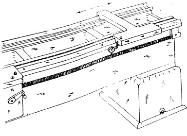
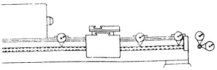
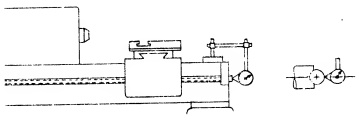

will be lower in relation to the lead screw than formerly. Likewise the rack may have to be lowered to prevent excessive play in the handwheel. Adjustments of this nature, though essential, do not pertain to the subject matter of this book and therefore will not be discussed further. However, the importance of the LeadScrew in the efficient operation of the machine justifies the space allotted to several tests concerning its alignment to the halfnut and the bed ways. These matters will now be discussed.

#### Sec. 26.69

Lead Screw Alignment.

## PROCEDURE:

Due to the removal of metal from various bearing surfaces, the lead screw will be misaligned if replaced without adjustment of its bearings. For proper adjustment the lead screw must be lowered to obtain a correct alignment with the half nuts. In addition, the lead screw must be aligned to the bed ways.

To test this alignment the lead screw is inserted in the bearings. The carriage is placed at the mid-point on the bed ways, closing the half nuts on the lead screw. A simple indicating jig, or the one shown in Fig. 26.67a, is then made up. When set in place it is guided by the front inverted V-way of the bed, and supported at the other end by the rear inverted V-way.

Next a DIAL INDICATOR is attached to the jig with the button adjusted to touch the lead screw at the vertical diameter. The apparatus is moved along the ways and checks are made at short intervals from end to end of the lead screw. This is repeated with the button at the horizontal diameter. The tolerance allowed is shown in Fig. 26.67b. If exceeded, the lead screw bearings are replaced or shimmed to obtain the correct alignment.

Fig. 26.66 (a) Back Lash on Cross Feed Screw (b) Back Lash on Compound Rest Screw

## RECOMMENDED STANDARDS

<table border=1 style='margin: auto; word-wrap: break-word;'><tr><td style='text-align: center; word-wrap: break-word;'>Tool Room</td><td style='text-align: center; word-wrap: break-word;'>12&quot; to 18&quot; inc.</td><td style='text-align: center; word-wrap: break-word;'>.20&quot; to 36&quot; inc.</td></tr><tr><td style='text-align: center; word-wrap: break-word;'>Lathes</td><td style='text-align: center; word-wrap: break-word;'>Engine Lathes</td><td style='text-align: center; word-wrap: break-word;'>Engine Lathes</td></tr><tr><td style='text-align: center; word-wrap: break-word;'>(a) .004&quot;</td><td style='text-align: center; word-wrap: break-word;'>.004&quot;</td><td style='text-align: center; word-wrap: break-word;'>.005&quot;</td></tr><tr><td style='text-align: center; word-wrap: break-word;'>(b) .004&quot;</td><td style='text-align: center; word-wrap: break-word;'>.004&quot;</td><td style='text-align: center; word-wrap: break-word;'>.005&quot;</td></tr></table>

Fig. 26.67(a) General arrangement for testing lead screw alignment with bed ways.

Fig. 26.67(b) Alignment of lead screw

## RECOMMENDED STANDARDS

Tool Room 12" to 18" inc. 20" to 36" inc.

Lathes Engine Lathes Engine Lathes

0 to .004" 0 to .004" 0 to .005"

(Parallel with ways horizontal and vertical)

0 to .006" 0 to .006" 0 to .008"

(Alignment of half nut horizontal or vertical)

Sec. 25.70

Lead Screw Cam Action

## PROCEDURE:

This test is designed to show the maximum permissible cam action of the lead screw. Fig. 26.68 shows the set up which should be self explanatory. The tolerance is also indicated.

Fig. 26.63 Lead Screw Cam Action

RECOMMENDED STANDARDS

<table border=1 style='margin: auto; word-wrap: break-word;'><tr><td style='text-align: center; word-wrap: break-word;'>Too! Room</td><td style='text-align: center; word-wrap: break-word;'>12&quot; to 18&quot; inc.</td><td style='text-align: center; word-wrap: break-word;'>20&quot; to 36&quot; inc.</td></tr><tr><td style='text-align: center; word-wrap: break-word;'>Lathes</td><td style='text-align: center; word-wrap: break-word;'>Engine Lathe</td><td style='text-align: center; word-wrap: break-word;'>Engine Lathe</td></tr><tr><td style='text-align: center; word-wrap: break-word;'>max. ,0003&quot;</td><td style='text-align: center; word-wrap: break-word;'>max. ,0004&quot;</td><td style='text-align: center; word-wrap: break-word;'>max. ,0005&quot;</td></tr></table>

<table border=1 style='margin: auto; word-wrap: break-word;'><tr><td style='text-align: center; word-wrap: break-word;'>Tool Room</td><td style='text-align: center; word-wrap: break-word;'>12&quot; to 18&quot; inc.</td></tr><tr><td style='text-align: center; word-wrap: break-word;'>Lathes</td><td style='text-align: center; word-wrap: break-word;'>Engine Lathes</td></tr><tr><td style='text-align: center; word-wrap: break-word;'>(a) .004 &quot;</td><td style='text-align: center; word-wrap: break-word;'>.004&quot;</td></tr><tr><td style='text-align: center; word-wrap: break-word;'>(b) .004 &quot;</td><td style='text-align: center; word-wrap: break-word;'>.004&quot;</td></tr></table>

<table border=1 style='margin: auto; word-wrap: break-word;'><tr><td style='text-align: center; word-wrap: break-word;'>(a)</td><td style='text-align: center; word-wrap: break-word;'>.004&quot;</td><td style='text-align: center; word-wrap: break-word;'>.004&quot;</td><td style='text-align: center; word-wrap: break-word;'>.005&quot;</td></tr><tr><td style='text-align: center; word-wrap: break-word;'>(b)</td><td style='text-align: center; word-wrap: break-word;'>.004&quot;</td><td style='text-align: center; word-wrap: break-word;'>.004&quot;</td><td style='text-align: center; word-wrap: break-word;'>.005&quot;</td></tr></table>

<table border=1 style='margin: auto; word-wrap: break-word;'><tr><td style='text-align: center; word-wrap: break-word;'>max.</td><td style='text-align: center; word-wrap: break-word;'>.0003&quot;</td><td style='text-align: center; word-wrap: break-word;'>max.</td><td style='text-align: center; word-wrap: break-word;'>.0004&quot;</td><td style='text-align: center; word-wrap: break-word;'>max.</td><td style='text-align: center; word-wrap: break-word;'>.0005&quot;</td></tr></table>