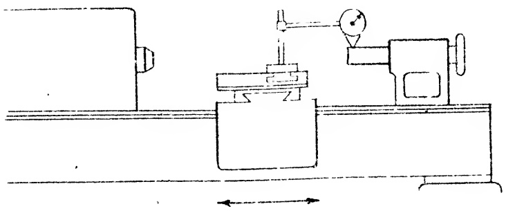
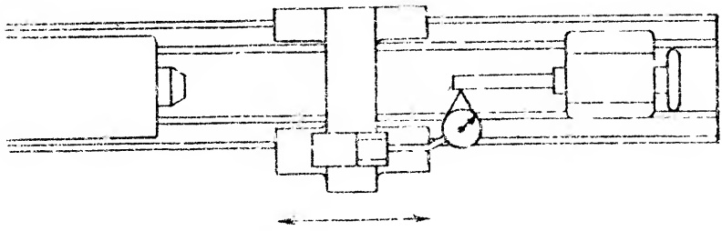

RECOMMENDED STANDARDS

RECOMMENDED STANDARDS
Tool Room 12" to 18" inc. 20" to 36" inc.
Lathes Engine Lathes Engine Lathes
0 to (±).0005" 0 to (±).0008" 0 to (±).0015"
(At end of 12 inch test bar)

During the initial stages of testing, the tailstock may simply be placed in position on the bed. But in the final stages, it should be clamped to the bed so that the tests will be conducted under circumstances similar to actual operating conditions.

This concludes the scraping operations on the tailstock member, although two additional tests must be conducted with the spindle before the member can be accepted for use.

#### Sec. 26.56

The Tailstock Spindle Taper Hole Alignment.

Briefly, the purpose of the following tests is to make certain that the tapered spindle hole has been properly machined, reamed, or ground so that the axis of the tapered hole is “in-line” with the axis of the lathe, or more specifically, “in-line” with the axis of the tailstock spindle.

To prove the accuracy of the alignment of the tapered hole in the tailstock spindle, two tests are conducted consecutively. Strictly speaking, the following tests do not concern scraping operations, but they are, nonetheless, vital to the successful alignment of this lathe member. When the accuracy of the tapered hole falls below the recommended standards, the tailstock spindle hole must be reworked, or a new spindle inserted.

Preliminary to conducting these tests it is necessary to make up a test bar. The bar is made of steel, hardened and accurately ground to fit the tapered hole in the spindle. It should have a straight portion of suitable length, usually 12". On some lathes, the test bar prepared for the tailstock can be used later on for the headstock, provided the tapered hole is identical in both members. When it is dissimilar, a separate bar is required for each member.

## CAUTION:

It is not good practice to “bush” a test bar in order to adapt it to a larger hole.

Having prepared the bar, insert it into the tapered hole in the spindle., Make certain that the contacting surfaces are perfectly clean. Foreign matter may prevent the two tapers from seating accurately and

this leads invariably to unreliable read- ings. It is also obvious that the two tapers must be identical. For additional infor- mation on this point, refer to Sec. 15.4.

Fig. 26.51 Final alignment of tailstock spindle to bed ways in vertical plane.

<table border=1 style='margin: auto; word-wrap: break-word;'><tr><td colspan="4">RECOMMENDED STANDARDS</td></tr><tr><td style='text-align: center; word-wrap: break-word;'>Tool Room</td><td style='text-align: center; word-wrap: break-word;'>12&quot; to 18&quot; inc.</td><td style='text-align: center; word-wrap: break-word;'>20&quot; to 36&quot; inc.</td><td style='text-align: center; word-wrap: break-word;'></td></tr><tr><td style='text-align: center; word-wrap: break-word;'>Lathes</td><td style='text-align: center; word-wrap: break-word;'>Engine Lathes</td><td style='text-align: center; word-wrap: break-word;'>Engine Lathes</td><td style='text-align: center; word-wrap: break-word;'></td></tr><tr><td style='text-align: center; word-wrap: break-word;'>0 to .0005&quot;</td><td style='text-align: center; word-wrap: break-word;'>0 to .0008&quot;</td><td style='text-align: center; word-wrap: break-word;'>0 to .0015&quot;</td><td style='text-align: center; word-wrap: break-word;'></td></tr><tr><td colspan="4">(High at enc. of spindle when fully extended)</td></tr></table>

The first test, diagrammed in Fig. 26.52 determines if the axis of the tapered hole in the spindle is “in-line” with the axis of the tailstock spindle in the horizontal plane. A DIAL INDICATOR is mounted on the carriage and adjusted against the near side of the test bar at the horizontal diameter. A reading is taken, as the carriage is moved forward. If the plus or minus tolerance shown in the Figure is not exceeded, the axis of the tapered hole in the spindle, is correctly aligned to the axis of the spindle in the horizontal plane.

Fig. 26.52 Alignment of taper hole of tailstock in horizontal plane.

The next test which is diagrammed in Fig. 26.53 discloses if the axis of the