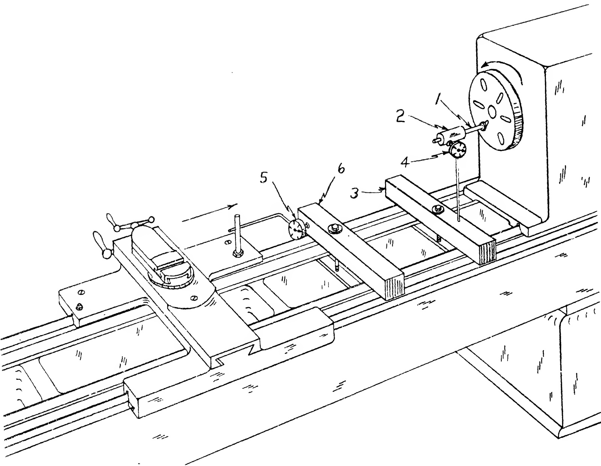

Fig. 26.70(b) Testing pitch error in lead screw. 2nd Phase. Stop Position. The carriage has been advanced 12 inches more or less in direction of Arrow. Any variation in the reading of DIAL attached to the carriage indicates the pitch error.

3. If the tests were conducted so as to obtain pertinent information. Unless clear thinking is the order, it is entirely possible to perform spurious tests which prove nothing and have no significance or application to the problem.

4. If a careful and workmanlike job of scraping was done.

5. If room temperatures did not vary widely during the period when alignment tests were made.

6. If all surfaces of members in contact were free of dirt, grit, and thick coatings of marking compound or films of heavy oil.

7. If indicating jigs were rigidly made and properly applied.

8. If SURFACE PLATES, Templates, and other spotting tools were in perfect condition.

When any of these factors has been slighted by the scraping operator, or if machine repairs on spindles, gearing etc. were performed in a slip shod fashion, then we are almost certain to experience trouble in securing satisfactory results under actual operating conditions. To dismantle the lathe again, to correct some individual fault, is definitely not good practice. Furthermore, it suggests the possibility that other dependent surfaces or alignments may also require rectification.

It is always good practice to run in the machine under power for about one hour. During this warming-up period, the various members are repeatedly tested for quietness and smoothness of movement. When the machine attains a constant, normal, operating temperature the Final Tests under Working Conditions may be performed.

Tests Under Operating Conditions

Now we will proceed to tests under actual working conditions.