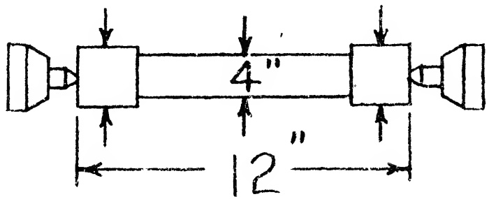

<table border=1 style='margin: auto; word-wrap: break-word;'><tr><td style='text-align: center; word-wrap: break-word;'>Tool Room</td><td style='text-align: center; word-wrap: break-word;'>12&quot; to 18&quot; inc.</td><td style='text-align: center; word-wrap: break-word;'>20&quot; to 36&quot; inc.</td></tr><tr><td style='text-align: center; word-wrap: break-word;'>Lathe</td><td style='text-align: center; word-wrap: break-word;'>Engine Lathes</td><td style='text-align: center; word-wrap: break-word;'>Engine Lathe</td></tr><tr><td style='text-align: center; word-wrap: break-word;'>.0004&quot;</td><td style='text-align: center; word-wrap: break-word;'>.0008&quot;</td><td style='text-align: center; word-wrap: break-word;'>.001&quot;</td></tr></table>

There are several possible causes if a taper is in evidence, namely:

1. The lathe is no longer level. This is an unlikely possibility if the lathe has not been moved from the location where it was reconditioned. It is, however, a simple matter to check the levelness of the lathe to make certain that the shims have not shifted.

2. The ways have a “wind”. If the outer inverted V-ways of the bed were scraped in a slipshod manner it is possible they are not straight. They must be checked to determine their accuracy. Pertinent tests would include, the Microscope & Taut Wire System, Water Level System.

3. The headstock is misaligned. This means that the headstock spindle may not be parallel to the DATUM PLANE. Repeating tests given in Sec. 26.63 and shown in Fig. 26.59 and Fig. 26.60 will determine if the error can be charged to this component. In order to correct any misalignment discovered, the entire scraping and testing procedure commencing with Sec. 26.63 must be repeated because related members were dependent upon the alignment of the headstock spindle and they will now be out of true.

(As an alternative to machining two collars, the accuracy of alignment of the headstock spindle may be determined by boring a hole with the work piece held in the chuck. If a taper develops, the source of error may be located in one of the possibilities outlined above.)

#### Sec. 26.76

Lathe must turn cylindrical with the Work mounted between centers.

## PROCEDURE:

A length of cylindrical bar stock of appropriate diameter is centered at both ends and placed between the lathe centers. Using a light cut and fine feed, two collars of the same or random diameter are machined on the bar. One of the collars is formed near the headstock center and the other adjacent to the tailstock center. Certain measurements will now be made on these collars to prove that the lathe can turn out accurate work as specified above.

### 1. To determine roundness

The collar at the headstock end, in particular, should be “miked” because there the error, if any, will be most pronounced. The collar is measured on the vertical and horizontal diameters and at intermediate points. If out-of-roundness is apparent the error may be attributed to the following sources:

(a) Inaccurate spindle or spindle bearings. Refer to Sec. 26. $ ^{74} $.

(b) Spindle center run out. Refer to Sec. 26.59 and see Fig. 26.55.

These causes of out-of-roundness should be investigated and the fault corrected before searching for other possible errors.

### 2. To determine cylindricity:

Next a very light finishing cut is taken across both collars without changing the setting of the tool. Then the diameter of each collar is “miked” at several places. The tolerance allowed is shown in Fig. 26.73. The measurements of one collar

Fig. 26.73 Lathe must turn cylindrical with the work mounted between centers.

RECOMMENDED STANDARDS

must correspond to the measurements of the second, otherwise a taper is indicated. A taper may be due to the following reasons:

(a) The bed is not level. To dispose of this possibility, repeat the leveling checks described in Sec. 26.38. The tolerance is given in Fig. 26.29a and Fig. 26.29b.