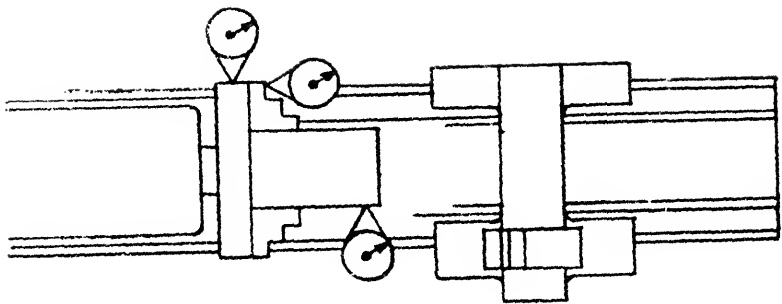
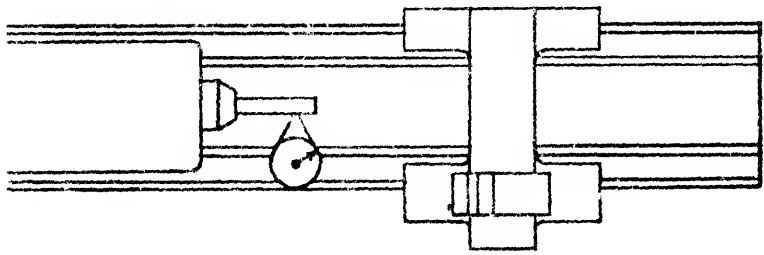

<table border=1 style='margin: auto; word-wrap: break-word;'><tr><td style='text-align: center; word-wrap: break-word;'>.003&quot;</td><td style='text-align: center; word-wrap: break-word;'>.003&quot;</td><td style='text-align: center; word-wrap: break-word;'>.004&quot;</td></tr><tr><td colspan="3">(Bar test 3&quot; from end of jaw.</td></tr><tr><td colspan="3">Bar diameter same as hole)</td></tr></table>

Sec. 26.77

Lathe to Face Concave Only

## PROCEDURE:

For this test the face plate is mounted on the headstock spindle. Lock the carriage and set the lathe cutting tool to take a light facing cut. After the cut is completed, the alignment of the guiding way of the carriage may be tested by means of the Three Papers Method. (Sec. 22.4)

To perform this operation, three paper slips are positioned in a row against the face plate. One paper is placed near the middle. The other two are oppositely located at the outer rim of the face plate. They are held there by pressing them with a hardened steel straight edge. By judging the drag of the center paper as it is removed, the operator determines if the tolerance shown in Fig. 26.64 has been exceeded. If this is the case the carriage ways are misaligned with respect to the axis of the spindle. Correction of the error calls for rescraping the carriage slides, as discussed in Sec. 26.65.

This concludes the tests made on the assembled lathe. If all tests were satisfactorily finished, the lathe, insofar as the scraping and alignment of major members are concerned, may be considered completed.

No mention has been made of minor components, such as taper attachments, special fixtures etc. But it is felt that if scraping or alignment is needed on these members, there is sufficient information available in these pages to assist the scraping operator when treating them.

Accepted standards of Accuracy for a few common attachments are included herewith to serve as a guide.

Sec. 26.78

Chuck Run Out

## PROCEDURE:

The recommended standards of accuracy for chucks are illustrated in the accompanying Fig. 26.74.

Fig. 26.74 Chuck run out.

## RECOMMENDED STANDARDS

<table border=1 style='margin: auto; word-wrap: break-word;'><tr><td style='text-align: center; word-wrap: break-word;'>Tool Room</td><td style='text-align: center; word-wrap: break-word;'>12&quot; to 18&quot; inc.</td><td style='text-align: center; word-wrap: break-word;'>20&quot; to 36&quot; inc.</td></tr><tr><td style='text-align: center; word-wrap: break-word;'>Lathes</td><td style='text-align: center; word-wrap: break-word;'>Engine Lathes</td><td style='text-align: center; word-wrap: break-word;'>Engine Lathes</td></tr><tr><td style='text-align: center; word-wrap: break-word;'>.003&quot;</td><td style='text-align: center; word-wrap: break-word;'>.003&quot;</td><td style='text-align: center; word-wrap: break-word;'>.004&quot;</td></tr><tr><td style='text-align: center; word-wrap: break-word;'>(face and periphery)</td><td style='text-align: center; word-wrap: break-word;'></td><td style='text-align: center; word-wrap: break-word;'></td></tr><tr><td style='text-align: center; word-wrap: break-word;'>.003&quot;</td><td style='text-align: center; word-wrap: break-word;'>.003&quot;</td><td style='text-align: center; word-wrap: break-word;'>.004&quot;</td></tr><tr><td style='text-align: center; word-wrap: break-word;'>(face of steps)</td><td style='text-align: center; word-wrap: break-word;'></td><td style='text-align: center; word-wrap: break-word;'></td></tr><tr><td style='text-align: center; word-wrap: break-word;'>.003&quot;</td><td style='text-align: center; word-wrap: break-word;'>.003&quot;</td><td style='text-align: center; word-wrap: break-word;'>.004&quot;</td></tr></table>

Sec. 26.79

Collet Chuck Run Out

## PROCEDURE:

The set up shown in Fig. 26.75 will indicate any variation from the recommended standards for collet chucks.

Fig. 26.75 Collet chuck run out.

## RECOMMENDED STANDARDS

<table border=1 style='margin: auto; word-wrap: break-word;'><tr><td style='text-align: center; word-wrap: break-word;'>Tool Room</td><td style='text-align: center; word-wrap: break-word;'>12&quot; to 18&quot; inc.</td><td style='text-align: center; word-wrap: break-word;'>20&quot; to 36&quot; inc.</td></tr><tr><td style='text-align: center; word-wrap: break-word;'>Lathes</td><td style='text-align: center; word-wrap: break-word;'>Engine Lathes</td><td style='text-align: center; word-wrap: break-word;'>Engine Lathe</td></tr><tr><td style='text-align: center; word-wrap: break-word;'>0 to .001&quot;</td><td style='text-align: center; word-wrap: break-word;'>0 to .001&quot;</td><td style='text-align: center; word-wrap: break-word;'>0 to .001&quot;</td></tr><tr><td colspan="3">(one inch from spindle)</td></tr></table>