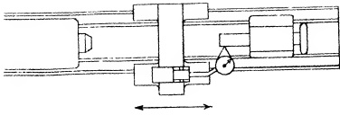

<table border=1 style='margin: auto; word-wrap: break-word;'><tr><td colspan="3">RECOMMENDED STANDARDS</td></tr><tr><td style='text-align: center; word-wrap: break-word;'>Tool Room</td><td style='text-align: center; word-wrap: break-word;'>12&quot; to 18&quot; inc.</td><td style='text-align: center; word-wrap: break-word;'>20&quot; to 36&quot; inc.</td></tr><tr><td style='text-align: center; word-wrap: break-word;'>lathes</td><td style='text-align: center; word-wrap: break-word;'>Engine Lathes</td><td style='text-align: center; word-wrap: break-word;'>Engine Lathes</td></tr><tr><td style='text-align: center; word-wrap: break-word;'>0 to .0005&quot;</td><td style='text-align: center; word-wrap: break-word;'>0 to .0005&quot;</td><td style='text-align: center; word-wrap: break-word;'>0 to .0005&quot;</td></tr><tr><td colspan="3">(Forward at end of spindle when fully extended)</td></tr></table>

Fig. 26.50 Final alignment of tailstock spindle to bed ways in horizontal plane.

It makes no difference where the tailstock is placed on the ways for these operations, since the bed should now be in perfect condition. Ordinarily, one part of the bed ways is used as the position from which to conduct the alignment tests. Another portion is coated with compound and utilized as a spotting template. This practice increases speed because much clean up time is eliminated.

Two consecutive tests are conducted in attaining OBJECTIVE NO. 1. Both utilize the line of travel of the carriage along the bed ways as the medium whereby the axis of the tailstock spindle is tested for parallelism with the outer inverted V-ways of the bed.

To expedite the work, the apron is attached to the carriage. It takes but a few minutes, and then the handwheel may be used to move the member. This procedure is preferable to pushing the carriage by hand, because both the speed of traverse and the stopping point are more accurately controlled. (It is unnecessary to mount the lead screw to attach the apron.)

The first test consists of checking whether the axis of the fully extended tail-stock spindle is parallel to the outside inverted V-ways of the bed in the horizontal plane. To conduct the survey a DIAL INDICATOR is mounted on the carriage, or more specifically, on the compound slide rest because this member is provided with a T-slot to which a suitable fixture may be conveniently bolted. The DIAL INDICATOR is positioned to bear against the near side of the extended spindle at the horizon-

tal diameter. (The tailstock spindle is clamped in the fully extended position.) To obtain a reading, the carriage is moved along the bed ways. The alignment of the tailstock spindle in the horizontal plane is considered acceptable if the unilateral tolerance indicated in Fig. 26.51 is not exceeded.

The second test consists of checking whether the axis of the fully extended tailstock spindle is parallel to the outer inverted V-ways of the bed, in the vertical plane. The spindle remains in the same fully extended position occupied for the previous test, but now the DIAL INDICATOR is adjusted so as to ride the top of the spindle at the vertical diameter. By moving the carriage on the inverted V-ways of the bed another reading can be taken. The alignment of the tailstock spindle in the vertical plane is acceptable if the unilateral tolerance shown in Fig. 26.51 is not exceeded.

In the recommended standards of both tests, working pressure is a factor. For example, in testing horizontally, it is the pressure of the tool against the work during a cut which must be taken into account. When testing vertically, it is the weight of the work piece for which allowance is made. If the unilateral tolerance is exceeded in either test, then the V-slide (1) and the flat slide (2) of the tailstock shown in Fig. 26.44 must be scraped so that the new alignment will conform to the tolerances given.

After determining the amount of error and its direction, the tailstock is removed to the portion of the bed ways reserved for spotting purposes. In doing this, the member must not be slid. Instead, it should be lifted and then placed carefully on the coated portion of the ways. Transfer of the film is made in the usual manner.

Scraping is most efficiently performed at a work bench. Before beginning this operation, a little reflection should enable the operator to determine how to scrape the tailstock V-slide so as to 'throw' the axis of the spindle in the proper direction, thereby correcting the error disclosed in the two tests. The amount of metal to be removed from the tailstock slides at this time should be slight, since all the OBJECTIVES, previously prescribed for these surfaces, have been designed so that only a light touching up would be necessary during the Final Alignment.