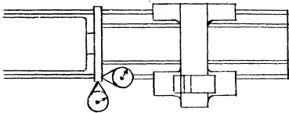

<table border=1 style='margin: auto; word-wrap: break-word;'><tr><td colspan="4">Recommended Standards ⚠</td></tr><tr><td style='text-align: center; word-wrap: break-word;'>Tool Room</td><td style='text-align: center; word-wrap: break-word;'>12&quot; to 18&quot; inc.</td><td style='text-align: center; word-wrap: break-word;'>20&quot; to 36&quot; inc.</td><td style='text-align: center; word-wrap: break-word;'></td></tr><tr><td style='text-align: center; word-wrap: break-word;'>Lathes</td><td style='text-align: center; word-wrap: break-word;'>Engine Lathes</td><td style='text-align: center; word-wrap: break-word;'>Engine Lathe</td><td style='text-align: center; word-wrap: break-word;'></td></tr><tr><td style='text-align: center; word-wrap: break-word;'>0 to .0005&quot;</td><td style='text-align: center; word-wrap: break-word;'>0 to .001&quot;</td><td style='text-align: center; word-wrap: break-word;'>0 to .0015&quot;</td><td style='text-align: center; word-wrap: break-word;'></td></tr><tr><td colspan="4">(on diameter)</td></tr><tr><td style='text-align: center; word-wrap: break-word;'>0 to .001&quot;</td><td style='text-align: center; word-wrap: break-word;'>0 to .0015&quot;</td><td style='text-align: center; word-wrap: break-word;'>0 to .002&quot;</td><td style='text-align: center; word-wrap: break-word;'></td></tr><tr><td colspan="4">(on face at nominal diameter)</td></tr></table>

Sec. 26.81

Effects of Inaccurate Leveling

RECOMMENDED STANDARDS

Sec. 26.80
Face Plate Run Out

PROCEDURE:

The accompanying Fig. 26.76 furnishes the accuracy standard for face plates.

Fig. 26.76 Face Plate run out.

Although the lathe was leveled prior to scraping, this procedure must be repeated again if the machine is moved to another place for permanent erection. Any relocation of the bed necessitates the exercise of due care on the part of the user. If the machine is placed in operation when the lathe bed is not level, serious trouble will be experienced. The ways of the bed become twisted thereby initiating a whole series of unfortunate consequences. For example, when the ways of the bed are twisted due to faulty leveling the carriage slides cannot fit properly. Operated in this condition, chatter marks will be generated on the work piece.

A “wind” in the bed ways, attributable to improper leveling, will also twist the headstock out of line. This binds the spindle in its bearings. The bearings may score and deterioration is accelerated. Chatter marks are formed on the work piece by this cause also.

Improper leveling, besides impairing surface quality, likewise affects the accuracy of the work output in the following manner. Work held in a chuck cannot be turned straight, nor can a hole be bored which will not taper. It is also impossible to turn work straight when held between centers.

To function accurately, a lathe regardless of size, or weight must be perfectly level before being placed in use. It is the purpose of the leveling process to relieve strains and distortion and restore the bed to the plane in which it was scraped.