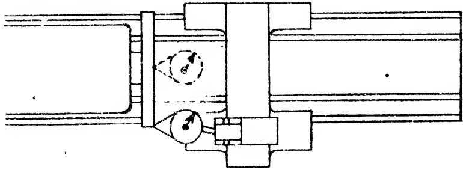
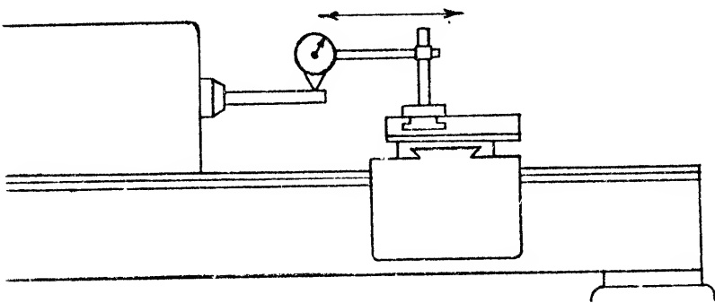

to a correct alignment with the rear carriage gib way of the bed. Obviously, the gib piece will also be affected by this change and may require extensive rescraping depending upon the amount of error disclosed.

Sec. 26.66

OBJECTIVES: Final Alignment Test of Compound Rest Top.

1. Movement of compound rest top to be parallel to headstock spindle in vertical plane.

## PROCEDURE:

The compound rest is used for machining or boring a steep taper and unless the tool is exactly on-center throughout its entire travel, a true taper will not be generated. In short, the surface lines of the work piece will be hyperbolic instead of straight and tapered. It is to ensure this condition that we make a final test on the compound rest top, after the carriage V-slides have been scraped so as to correctly align the movement of the cross slide.

Returning to the procedure, the test bar is inserted into the headstock spindle and, after the customary runout is performed, revolved to place the mean position of eccentricity error in the vertical plane. A DIAL INDICATOR mounted on the compound rest top should be adjusted to permit the INDICATOR button to touch the test bar at the vertical diameter.

The compound rest is swiveled so that the movement of the compound rest top parallels the bed ways. By turning the feed screw, the compound rest traverses, sliding the button along the test bar.

Fig. 26.64 Testing alignment of cross slide movement to axis of headstock.

RECOMMENDED STANDARDS

<table border=1 style='margin: auto; word-wrap: break-word;'><tr><td style='text-align: center; word-wrap: break-word;'>Tool Room</td><td style='text-align: center; word-wrap: break-word;'>12&quot; to 18&quot; inc.</td><td style='text-align: center; word-wrap: break-word;'>20&quot; to 36&quot; inc.</td></tr><tr><td style='text-align: center; word-wrap: break-word;'>Lathes</td><td style='text-align: center; word-wrap: break-word;'>Engine Lathes</td><td style='text-align: center; word-wrap: break-word;'>Engine Lathes</td></tr><tr><td style='text-align: center; word-wrap: break-word;'>0 to .0005&quot;</td><td style='text-align: center; word-wrap: break-word;'>0 to .001&quot;</td><td style='text-align: center; word-wrap: break-word;'>0 to .001&quot;</td></tr><tr><td colspan="3">(To face hollow or concave only on 12&quot; diameter)</td></tr></table>

The tolerance allowed is shown in Fig. 26.65. If this is exceeded, one possibility could be that the flat ways of the compound rest swivel were not scraped parallel with the swivel slide. Sec. 26.20 discusses a method of dealing with this.

This completes all scraping operations on the lathe. The feed screws of the cross slide and compound rest may now be checked.

Sec. 26.67

Back Lash on Feed Screws

## PROCEDURE:

The accompanying chart Fig. 26.66, discloses the recommended standards for the back lash on the cross feed screw and on the compound rest feed screw.

The feed screws are tested for back lash, while threaded into their respective nuts.

Fig. 26.65 Final alignment of compound rest top. Movement of slide parallel with work spindle in vertical plane. Tol. max. .0035" per foot.

If the tolerance is exceeded, the nut should be replaced or, if of the compensating kind, adjusted to take up for wear.

Now that the alignments of the lathe members are finished, the next operation is the assembly of miscellaneous unattached parts. Strictly speaking, this is not scraping work, but it may nonetheless be the responsibility of the operator.

#### Sec. 26.68

Assembly of Lead Screw and Apron

In assembling the lead screw and apron, one point to watch is the adjustment that may be required between the lead screw bearings and the half nut to accommodate them to each other under the new and changed conditions. Since more or less metal has been scraped from both the bed ways and the carriage slides, it is obvious that the present position of the half nuts