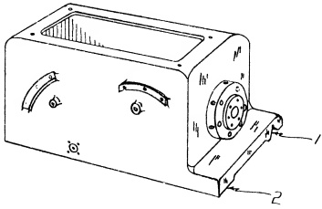
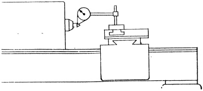
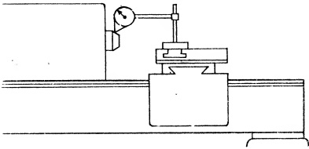

<table border=1 style='margin: auto; word-wrap: break-word;'><tr><td colspan="3">RECOMMENDED STANDARDS</td></tr><tr><td style='text-align: center; word-wrap: break-word;'>Tool Room</td><td style='text-align: center; word-wrap: break-word;'>12&quot; to 18&quot; inc.</td><td style='text-align: center; word-wrap: break-word;'>20&quot; to 36&quot; inc.</td></tr><tr><td style='text-align: center; word-wrap: break-word;'>Lathes</td><td style='text-align: center; word-wrap: break-word;'>Engine Lathes</td><td style='text-align: center; word-wrap: break-word;'>Engine Lathes</td></tr><tr><td colspan="3">(Total indicator reading)</td></tr><tr><td style='text-align: center; word-wrap: break-word;'>0 to .0004&quot;</td><td style='text-align: center; word-wrap: break-word;'>0 to .0005&quot;</td><td style='text-align: center; word-wrap: break-word;'>0 to .00075&quot;</td></tr><tr><td colspan="3">Sec. 26.61</td></tr><tr><td colspan="3">Cam Action of Spindle (3rd test)</td></tr></table>

Sec. 26.59

Spindle Center Runout (1st test)

## PROCEDURE:

The test is begun by inserting a perfectly finished, live center into the tapered hole of the headstock spindle. The contact point of a DIAL INDICATOR is placed midway on the top of the  $ 60^{\circ} $ point of the live center. The spindle center runout is checked by revolving the spindle slowly.

This test will supply information on a number of matters, among them the correctness of the taper in the spindle; possible presence of burrs in the tapered hole; and concentricity of the axis of the tapered hole to the axis of the spindle. The tolerance shown in Fig. 26.55 cannot be exceeded.

Fig. 26.54 View of the head stock of lathe (1) V-slide (2) flat slide

Sec. 26.60

Spindle Nose Runout (2nd test)

## PROCEDURE:

In this test the DIAL INDICATOR is positioned on the nose of the headstock spindle as shown in Fig. 26.56. The actual position it should occupy, whether directly on the nose, or indirectly, by attaching an accurate test plate, will depend upon the type of chuck mounting used, i.e. threaded, taper, or cam lock.

This test will check the concentricity of the nose with the axis of the spindle. Any error noted must be within the limits of the tolerance.

Fig. 26.55 Spindle center run out.

## PROCEDURE:

The cam action of the spindle is determined in the following manner. An accurately machined test plate similar in design to the back plate of a chuck is attached. The DIAL INDICATOR button is positioned on the rear side of the test plate, as shown in Fig. 26.57. The tolerance is also indicated. For supplementary material on Cam Action refer to Sec. 16.11.

Fig. 26.56 Spindle nose run out

RECOMMENDED STANDARDS

Tool Room 12" to 18" inc. 20" to 36" inc.

Lathes Engine Lathes Engine Lathes

(Total indicator reading)

0 to .0003" 0 to .0004" 0 to .0006"

Having ascertained the accuracy of the spindle, the next step is to check the headstock spindle tapered hole.