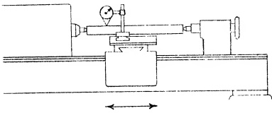
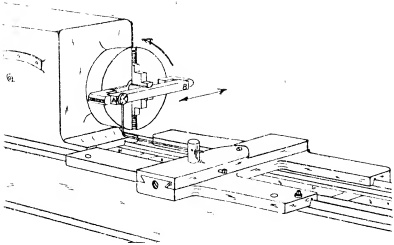

## PROCEDURE:

To determine the variation from correct alignment, the following test is now conducted. Incidentally, any set up which will accomplish the same purpose as the one here described may be used. In the present case a four jaw chuck is attached to the headstock spindle and a steel PARALLEL is then lightly clamped in the jaws, as illustrated in Fig. 26.63. The PARALLEL is adjusted so that approximately half of its length extends on either side of the spindle axis. Position the cross slide on the carriage, insert the cross slide gib and adjust for sliding pressure. Attach the gib bracket and adjust the carriage gib for sliding pressure. Next clamp the carriage to the bed.

Fig. 26.62 Alignment of head and tail centers in vertical plane.

<table border=1 style='margin: auto; word-wrap: break-word;'><tr><td colspan="3">RECOMMENDED STANDARDS</td></tr><tr><td style='text-align: center; word-wrap: break-word;'>Tool Rcom</td><td style='text-align: center; word-wrap: break-word;'>12&quot; to 18&quot; inc.</td><td style='text-align: center; word-wrap: break-word;'>20&quot; to 36&quot; inc.</td></tr><tr><td style='text-align: center; word-wrap: break-word;'>Lathes</td><td style='text-align: center; word-wrap: break-word;'>Engine Laihes</td><td style='text-align: center; word-wrap: break-word;'>Engine Laihes</td></tr><tr><td style='text-align: center; word-wrap: break-word;'>0&quot; to .0008&quot;</td><td style='text-align: center; word-wrap: break-word;'>0 to .001&quot;</td><td style='text-align: center; word-wrap: break-word;'>0 to .0015&quot;</td></tr><tr><td colspan="3">(High at tailstock end)</td></tr></table>

A DIAL INDICATOR is now mounted on the cross slide and placed in contact with the PARALLEL near one end, for example, at (A) in Fig. 26.63. Revolve the spindle, meanwhile adjusting the PARALLEL by tapping it. A zero-zero reading must be registered by the DIAL as each end (A) and (B) of the PARALLEL comes in contact with the plunger button of the instrument. When this is accomplished, the PARALLEL is square with the axis of the spindle.

Now turn the spindle until the steel PARALLEL is approximately level. Maintained in this position, the button of the device will not ride off as the slide rest is moved in and out transversely.

Fig. 26.63 Showing method of adjusting PARALLEL square to axis of spindle. Revolve spindle and adjust PARALLEL until a zero-zero reading is obtained as each end of the PARALLEL makes contact with DIAL INDICATOR.

Since a unilateral tolerance is allowed, as shown in Fig. 26.54, the DIAL can have a minus reading only, when moving the cross slide from the front side of the lathe towards the center. Conversely, it can have a plus reading only, when moving away from the center, towards the front side of lathe. If the tolerance is not exceeded, the transverse movement of the cross slide is satisfactory. However, if it does not pass this test, then the two V-slides of the carriage must be scraped so as to "throw" the cross slide in the correct direction and by the proper amount. When this test is passed, OBJECTIVE NO. 1 is satisfied.

By occasionally laying a PRECISION LEVEL on the flat ways in both the longitudinal and transverse directions, as shown previously, notably Fig. 26.30 and Fig. 26.32, a close check can be kept on OBJECTIVE NO. 2. This is essential because there is a tendency to tilt these surfaces if the scraping performed on the carriage slides is carelessly executed.

## IMPORTANT:

It might be worthwhile to emphasize that, although we are aligning the carriage ways, the correction is made on the carriage slides.

The surface quality required by CBI-JECTIVE NO. 3 should be produced simultaneously.

## NOTE:

Any rescraping of the carriage V-slides may also necessitate reworking the rear carriage gib bracket bearing