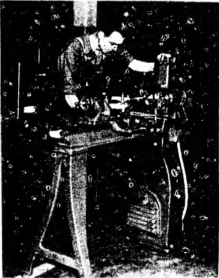
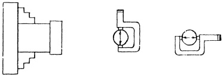
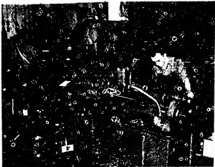
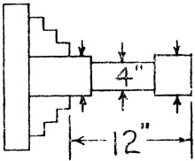

PLATE 36. Inspector taking a trial cut on a test piece held in lathe chuck to test truth of headstock. (Courtesy - South Bend Lathe Works.)

#### Sec. 26.74

Lathe Must Turn Round with Work Mounted in Chuck.

## PROCEDURE:

A short bar of steel, two or more inches in diameter, is placed in the chuck. A skim cut is taken on the bar, following which it must check round within the tolerances given in Fig. 26.71. If excessive

Fig. 26.71 Lathe must turn round with work mounted in chuck.

## RECOMMENDED STANDARDS

out-of-roundness is noted, an examination of the headstock main bearings and spindle should reveal the cause of the inaccuracy.

PLATE 37. General view in factory showing inspector at work testing the alignment of the headstock spindle on the lathe bed. Note the test bar in spindle of lathe to left rear. (Courtesy - South Bend Lathe Works.)

#### Sec. 26.75

Lathe must turn Cylindrical with Work Mounted in Chuck.

## PROCEDURE:

A length of steel bar stock of suitable diameter is mounted in the chuck. Two collars are machined on the work piece; one collar near the chuck jaws, the other collar at the free end of the bar.

The next step is to take a very light finishing cut across one collar, and without changing the adjustment of the tool, the cut is continued across the other collar. The diameter of each collar should be the same, otherwise a taper is indicated. The tolerance allowed is shown in Fig. 26.72.

Fig. 26.72 Lathe must turn cylindrical with work mounted in chuck.

## RECOMMENDED STANDARDS

<table border=1 style='margin: auto; word-wrap: break-word;'><tr><td style='text-align: center; word-wrap: break-word;'>Tool RoomLathe.0003&quot;</td></tr></table>

<table border=1 style='margin: auto; word-wrap: break-word;'><tr><td style='text-align: center; word-wrap: break-word;'>Tool Room
Lathe
.0008”</td></tr></table>